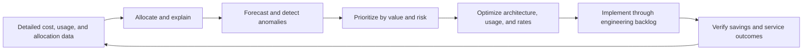

# 成本管理和 FinOps 最佳实践

## 目的

本文档定义了企业 FinOps 实践，以最大限度地提高云和相关技术支出的业务价值。它应用于 Azure、AWS、GCP、OCI、SaaS、数据平台、AI 服务以及组织可以度量使用情况并影响成本的其他可变成本技术。

成本优化并不意味着无论后果如何都最大限度地减少支出。 决策 MUST 考虑可靠性、安全性、性能、交付速度、可持续性和商业价值。

## 规范语言

关键字 **MUST**、**MUST NOT**、**REQUIRED**、**SHOULD**、**SHOULD NOT** 和 **MAY** 是规范性的：

- **MUST / MUST NOT**：对于范围内的平台和工作负载是强制性的。
- **SHOULD / SHOULD NOT**：预期，除非基于风险的例外情况得到批准。
- **MAY**：可选，根据工作负载需求选择。

当云提供商功能无法直接实现需求时，实现 MUST 提供等效控制并在架构决策记录（ADR）中记录等效性。

## FinOps 原则

1. **团队协作。** 工程、财务、产品、采购和领导层共享决策。
2. **业务价值驱动决策。** 支出是根据结果来评估的，而不仅仅是每月的总额。
3. **负责人负责。** 每项重大成本都必须有负责的团队和分配方法。
4. **数据及时且可用。** 成本、使用、承诺和分配数据 MUST 可按决策节奏访问。
5. **优化是持续的。** 架构、使用、速率和需求变化需要经常性的行动。
6. **集中支持，分布式行动。** 中央 FinOps 功能提供标准和工具；产品团队根据他们的资源采取行动。

## 强制性要求

|要求 |控制语句|最低限度的证据|
|---|---|---|
| `SBP-12-REQ-001` |所有重大云支出 MUST 分配给负责任的所有者、应用/产品、环境和成本对象。 |分配覆盖率报告|
| `SBP-12-REQ-002` |账单导出或等效的详细成本和使用数据 MUST 被集中并保留以供分析。 |导出配置和数据新鲜度|
| `SBP-12-REQ-003` |预算和预测 MUST 在有意义的范围内制定，并与工程和产品负责人一起审查。 |预算/预测日志记录|
| `SBP-12-REQ-004` |重大成本异常 MUST 生成告警，并发送给负责的所有者并提供调查指导。 |异常规则和事件/通知单 |
| `SBP-12-REQ-005` |新架构和重大变化 MUST 包括基于假设、增长驱动因素和敏感性的成本估算。 |架构成本模型|
| `SBP-12-REQ-006` | 团队 MUST 定期审查闲置、孤立、超大、过时和非生产资源。 |优化待办事项和行动|
| `SBP-12-REQ-007` |调整规模决策 MUST 考虑性能、可靠性、许可和运营空间。 |推荐决策记录|
| `SBP-12-REQ-008` |承诺折扣和预订 MUST 仅可根据度量的稳定需求购买，并集中管理或通过批准的模型进行管理。 |承诺分析及审批 |
| `SBP-12-REQ-009` |承诺利用率、覆盖范围、到期日和集中风险 MUST 受到监控。 |承诺仪表板 |
| `SBP-12-REQ-010` |存储、备份、日志、快照、数据传输和公共 IP 成本 MUST 不仅包括计算成本，还包括在优化审核中。 |成本类别报告|
| `SBP-12-REQ-011` |非生产环境 SHOULD 使用计划、自动扩缩容、配额和临时模式来匹配实际需求。 |时间表和利用证据|
| `SBP-12-REQ-012` |成本分配规则、共享成本方法、信贷、税收和市场费用 MUST 记录在案并可重复。 |分配方法|
| `SBP-12-REQ-013` |为主要产品定义单位成本指标 SHOULD，例如每个客户的成本、交易、模型推理、流水线运行或环境。 |单位经济仪表板|
| `SBP-12-REQ-014` |优化操作 MUST 在实施后进行验证，以确认节省并避免服务降级。 |验证之前/之后 |
| `SBP-12-REQ-015` | FinOps 策略 MUST 定义预算、承诺、例外和成本风险权衡的决策权。 | RACI 和策略 |
| `SBP-12-REQ-016` |成本数据访问 MUST 保护商业敏感信息和客户信息，同时保持责任团队可用。 |准入策略|

## FinOps 操作循环

## 详细执行标准

### 成本数据基础

详细的计费数据 MUST 至少每天导出到分析平台，除非提供商或服务仅支持较低的频率。数据模型 SHOULD 规范化提供商、计费账户、账户/订阅/项目、服务、SKU、区域、资源、标签/标签、承诺、信用、货币和摊销成本。

报告 MUST 区分相关的实际成本、摊销成本、未混合/列表成本、净成本和预测成本。混合没有标签的成本基础会产生误导性的决策。

### 分配和分担成本

直接成本 SHOULD 根据资源元数据分配。共享平台成本 MAY 按使用量、员工人数、收入、平均分配或其他获批驱动因素进行分配。所选方法 MUST 透明、足够稳定以支持决策，并定期接受审查。

未分配成本 MUST 可见；将其隐藏在中央存储桶中可以消除责任。分配差距 SHOULD 针对丢失的元数据或不受支持的计费维度创建修复工作。

### 预算、预测和异常情况

预算 MUST 反映预期需求而不是任意减少。预测 SHOULD 结合历史运行率、已知发布、季节性、契约承诺、迁移计划和优化操作。

异常告警 MUST 使用绝对阈值和百分比阈值来避免噪音。调查 SHOULD 识别使用情况变化、价格/SKU 变化、分配变化、迟到数据、承诺效果或未经授权的部署。

### 优化层次

团队 SHOULD 按以下顺序评估优化：

1.消除未使用或重复的需求；
2. 安排或自动调整可变需求；
3. 合理调整资源规模和服务层级；
4.提高软件和数据效率；
5. 选择更高效的架构和托管服务；
6.优化存储生命周期和数据传输；
7、稳定剩余需求的购买率承诺；和
8. 验证已实现的节省和服务影响。

在纠正浪费之前购买承诺可能会锁定低效需求。

### 单位经济性和 AI/数据工作负载

主要产品 SHOULD 跟踪与业务量相关的单位成本。AI 和数据平台 MUST 公开成本驱动因素，例如令牌、加速器时间、模型端点正常运行时间、扫描的数据、查询槽、集群时间、向量索引大小和数据出口。 质量、延迟和可靠性 MUST 与成本一起进行审查。

### 治理节奏

团队 SHOULD 至少每周进行异常分类、每月产品成本审查、季度承诺和架构审查以及年度 FinOps 成熟度和策略审查。 对于不稳定或高消费的服务，可以提高该频率。

## 多云实施映射

|能力|Azure|AWS | GCP |OCI |
|---|---|---|---|---|
|成本数据|Cost Management exports / Cost Details |Cost and Usage Report / Data Exports| Cloud Billing export to BigQuery |Cost Reports / Usage API / Object Storage exports |
|预算和异常情况|Budgets and Cost Management anomaly features| AWS Budgets and Cost Anomaly Detection |Budgets and anomaly capabilities / custom BigQuery analysis |Budgets and cost analysis alerts|
|推荐 | Azure Advisor |Cost Optimization Hub / Compute Optimizer|Recommender / Active Assist |Cloud Advisor |
|承诺|预订、储蓄计划、Azure 混合权益 |节省计划、预留实例 |承诺使用折扣 |预留容量和灵活的计算承诺（如果可用）|
|分配 |标签、订阅、资源组、管理组 |成本分配标签、账户、CUR 维度 |标签、项目、文件夹、账单导出 |定义标签、隔间、成本跟踪标签 |

提供商产品是实施示例，而不是规范要求的豁免。当满足相同的控制目标时，MAY 使用等效服务。

## 验证

|测量 |目标或解释 |
|---|---|
|分配范围|分配给所有者/产品/环境的支出百分比；目标接近100%。 |
|预测准确度 |决策相关范围内预测与实际之间的差异。 |
|异常响应时间|从异常检测到所有者确认和处置的时间。 |
|承诺利用率和覆盖范围|单独测量；利用率高，无需过度集中。 |
|实现节省 |经验证，扣除实施成本和服务影响后的成本降低情况。 |
|单位成本|随着时间的推移，每个批准的业务或技术单位的成本。 |

## 采用清单

- [ ] 集中详细的计费和使用情况导出。
- [ ] 强制执行所有权和分配元数据。
- [ ] 定义预算、预测和异常路由。
- [ ] 创建透明的共享成本分配规则。
- [ ] 查看空闲、孤立、超大、存储、日志和传输成本。
- [ ] 在购买承诺之前调整规模。
- [ ] 管理承诺的利用、覆盖范围、到期日和集中度。
- [ ] 定义产品单位成本指标。
- [ ] 验证节省和可靠性/性能影响。
- [ ] 进行定期的工程-财务-产品审查。

## 保障性证据

证据 MUST 可根据企业日志保留计划进行复制和保留。可接受的证据包括：

- 版本控制的配置和策略；
- 流水线日志和批准记录；
- 策略评估结果；
- 配置快照或清单导出；
- 测试和恢复报告；
- 带有查询定义的仪表板；和
- 批准的 ADR 和例外日志记录。

当机器可读证据可用时，仅 SHOULD NOT 屏幕截图可被视为主要证据。

## 治理、例外和执行

云卓越中心负责该标准。平台工程、安全性、可靠性、应用、数据和 FinOps 团队负责在其范围内实施控制。

例外情况 MUST 满足以下条件：

1. 识别未满足的需求 ID；
2. 描述业务合理性和量化风险；
3. 定义补偿性控制；
4. 指定一名负责任的所有者；
5. 包含不超过180天的有效期；和
6. 经控制所有者和相关风险主管部门批准。

过期的例外是不合规的。自动策略检查 SHOULD 阻止新的不合规部署。现有不合规项 MUST 通过修复积压、负责人和截止日期进行跟踪。
## 审核周期

本文件 MUST 至少每年审查一次，并且在云提供商能力、监管义务、企业风险承受能力或运营模式发生重大变化之后进行审查。更改 MUST 保留需求标识符，而底层控制意图保持不变。

## 相关主题

- [CI/CD 流水线与发布控制标准](ci-cd-pipeline-and-release-control-standard.md)
- [云安全和零信任标准](cloud-security-and-zero-trust-standard.md)
- [资源命名和标签标准](resource-naming-and-tagging-standard.md)

## 参考文档

- [FinOps Framework](https://www.finops.org/framework/)
- [FinOps Framework 2026](https://www.finops.org/insights/2026-finops-framework/)
- [Azure Well-Architected Framework：成本优化](https://learn.microsoft.com/azure/well-architected/cost-optimization/)
- [AWS Well-Architected Framework：成本优化](https://docs.aws.amazon.com/wellarchitected/latest/cost-optimization-pillar/welcome.html)
- [GCP Well-Architected Framework：成本优化](https://cloud.google.com/architecture/framework/cost-optimization)
- [OCI Cloud Adoption Framework：成本管理](https://docs.oracle.com/en-us/iaas/Content/cloud-adoption-framework/era-cost-management.htm)
