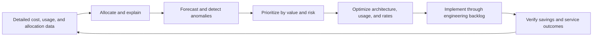

# Cost Management and FinOps Best Practices

## Purpose

This document defines enterprise FinOps practices for maximizing business value from cloud and related technology spend. It applies to Azure, AWS, GCP, OCI, SaaS, data platforms, AI services, and other variable-cost technology where the organization can measure usage and influence cost.

Cost optimization does not mean minimizing spend regardless of consequence. Decisions MUST account for reliability, security, performance, delivery speed, sustainability, and business value.

## Normative language

The key words **MUST**, **MUST NOT**, **REQUIRED**, **SHOULD**, **SHOULD NOT**, and **MAY** are normative:

- **MUST / MUST NOT**: mandatory for in-scope platforms and workloads.
- **SHOULD / SHOULD NOT**: expected unless a documented risk-based exception is approved.
- **MAY**: optional and selected according to workload requirements.

Where a cloud-provider feature cannot implement a requirement directly, the implementation MUST provide an equivalent control and record the equivalence in the architecture decision record (ADR).

## FinOps principles

1. **Teams collaborate.** Engineering, finance, product, procurement, and leadership share decisions.
2. **Business value drives decisions.** Spend is evaluated against outcomes, not only monthly totals.
3. **Owners are accountable.** Every material cost must have a responsible team and allocation method.
4. **Data is timely and usable.** Cost, usage, commitment, and allocation data MUST be accessible at the decision cadence.
5. **Optimization is continuous.** Architecture, usage, rate, and demand changes require recurring action.
6. **Central enablement, distributed action.** A central FinOps function provides standards and tooling; product teams act on their resources.

## Mandatory requirements

| Requirement | Control statement | Minimum evidence |
|---|---|---|
| `SBP-12-REQ-001` | All material cloud spend MUST be assigned to an accountable owner, application/product, environment, and cost object. | Allocation coverage report |
| `SBP-12-REQ-002` | Billing exports or equivalent detailed cost and usage data MUST be centralized and retained for analysis. | Export configuration and data freshness |
| `SBP-12-REQ-003` | Budgets and forecasts MUST be established at meaningful scopes and reviewed with engineering and product owners. | Budget/forecast records |
| `SBP-12-REQ-004` | Material cost anomalies MUST generate alerts routed to an accountable owner with investigation guidance. | Anomaly rule and incident/ticket |
| `SBP-12-REQ-005` | New architectures and material changes MUST include a cost estimate with assumptions, growth drivers, and sensitivity. | Architecture cost model |
| `SBP-12-REQ-006` | Teams MUST review idle, orphaned, oversized, obsolete, and non-production resources on a recurring cadence. | Optimization backlog and actions |
| `SBP-12-REQ-007` | Rightsizing decisions MUST consider performance, reliability, licensing, and operational headroom. | Recommendation decision record |
| `SBP-12-REQ-008` | Commitment discounts and reservations MUST be purchased only against measured stable demand and governed centrally or through an approved model. | Commitment analysis and approval |
| `SBP-12-REQ-009` | Commitment utilization, coverage, expiry, and concentration risk MUST be monitored. | Commitment dashboard |
| `SBP-12-REQ-010` | Storage, backup, log, snapshot, data-transfer, and public-IP costs MUST be included in optimization reviews, not only compute. | Cost category report |
| `SBP-12-REQ-011` | Non-production environments SHOULD use schedules, autoscaling, quotas, and ephemeral patterns to match actual demand. | Schedule and utilization evidence |
| `SBP-12-REQ-012` | Cost allocation rules, shared-cost methods, credits, taxes, and marketplace charges MUST be documented and reproducible. | Allocation methodology |
| `SBP-12-REQ-013` | Unit-cost metrics SHOULD be defined for major products, such as cost per customer, transaction, model inference, pipeline run, or environment. | Unit-economics dashboard |
| `SBP-12-REQ-014` | Optimization actions MUST be verified after implementation to confirm savings and avoid service degradation. | Before/after validation |
| `SBP-12-REQ-015` | FinOps policies MUST define decision rights for budgets, commitments, exceptions, and cost-risk tradeoffs. | RACI and policy |
| `SBP-12-REQ-016` | Cost data access MUST protect commercially sensitive and customer information while remaining available to accountable teams. | Access policy |

## FinOps operating loop

## Detailed implementation standard

### Cost data foundation

Detailed billing data MUST be exported into an analytics platform at least daily unless the provider or service supports only a lower frequency. Data models SHOULD normalize provider, billing account, account/subscription/project, service, SKU, region, resource, tags/labels, commitment, credit, currency, and amortized cost.

Reports MUST distinguish actual, amortized, unblended/list, net, and forecast cost where relevant. Mixing cost bases without labels produces misleading decisions.

### Allocation and shared costs

Direct costs SHOULD be assigned from resource metadata. Shared platform costs MAY be allocated by usage, headcount, revenue, equal split, or another approved driver. The chosen method MUST be transparent, stable enough for decisions, and periodically reviewed.

Unallocated cost MUST be visible; hiding it in a central bucket removes accountability. Allocation gaps SHOULD create remediation work for missing metadata or unsupported billing dimensions.

### Budgeting, forecasting, and anomalies

Budgets MUST reflect expected demand rather than arbitrary reductions. Forecasts SHOULD combine historical run rate, known launches, seasonality, contractual commitments, migration plans, and optimization actions.

Anomaly alerts MUST use both absolute and percentage thresholds to avoid noise. Investigation SHOULD identify usage change, price/SKU change, allocation change, late-arriving data, commitment effect, or unauthorized deployment.

### Optimization hierarchy

Teams SHOULD evaluate optimization in this order:

1. eliminate unused or duplicate demand;
2. schedule or autoscale variable demand;
3. rightsize resources and service tiers;
4. improve software and data efficiency;
5. choose more efficient architectures and managed services;
6. optimize storage lifecycle and data transfer;
7. purchase rate commitments for stable residual demand; and
8. validate realized savings and service impact.

Buying commitments before correcting waste can lock in inefficient demand.

### Unit economics and AI/data workloads

Major products SHOULD track a unit cost linked to business volume. AI and data platforms MUST expose cost drivers such as tokens, accelerator time, model endpoint uptime, data scanned, query slots, cluster hours, vector index size, and data egress. Quality, latency, and reliability MUST be reviewed alongside cost.

### Governance cadence

At minimum, teams SHOULD operate weekly anomaly triage, monthly product cost reviews, quarterly commitment and architecture reviews, and annual FinOps maturity and policy reviews. Cadence MAY be increased for volatile or high-spend services.

## Multi-cloud implementation mapping

| Capability | Azure | AWS | GCP | OCI |
|---|---|---|---|---|
| Cost data | Cost Management exports / Cost Details | Cost and Usage Report / Data Exports | Cloud Billing export to BigQuery | Cost Reports / Usage API / Object Storage exports |
| Budgets and anomalies | Budgets and Cost Management anomaly features | AWS Budgets and Cost Anomaly Detection | Budgets and anomaly capabilities / custom BigQuery analysis | Budgets and cost analysis alerts |
| Recommendations | Azure Advisor | Cost Optimization Hub / Compute Optimizer | Recommender / Active Assist | Cloud Advisor |
| Commitments | Reservations, Savings Plan, Azure Hybrid Benefit | Savings Plans, Reserved Instances | Committed Use Discounts | Reserved capacity and flexible compute commitments where available |
| Allocation | Tags, subscriptions, resource groups, management groups | Cost allocation tags, accounts, CUR dimensions | Labels, projects, folders, billing export | Defined tags, compartments, cost-tracking tags |

Provider products are implementation examples, not exemptions from the normative requirements. Equivalent services MAY be used when they satisfy the same control objective.

## Validation

| Measure | Target or interpretation |
|---|---|
| Allocation coverage | Percentage of spend assigned to owner/product/environment; target near 100%. |
| Forecast accuracy | Variance between forecast and actual at decision-relevant scopes. |
| Anomaly response time | Time from anomaly detection to owner acknowledgement and disposition. |
| Commitment utilization and coverage | Measured separately; high utilization without excessive concentration. |
| Realized savings | Verified cost reduction net of implementation cost and service impact. |
| Unit cost | Cost per approved business or technical unit over time. |

## Adoption checklist

- [ ] Centralize detailed billing and usage exports.
- [ ] Enforce ownership and allocation metadata.
- [ ] Define budgets, forecasts, and anomaly routing.
- [ ] Create transparent shared-cost allocation rules.
- [ ] Review idle, orphaned, oversized, storage, log, and transfer costs.
- [ ] Rightsize before purchasing commitments.
- [ ] Govern commitment utilization, coverage, expiry, and concentration.
- [ ] Define product unit-cost metrics.
- [ ] Verify savings and reliability/performance impact.
- [ ] Run recurring engineering-finance-product reviews.

## Assurance evidence

Evidence MUST be reproducible and retained according to the enterprise records schedule. Acceptable evidence includes:

- version-controlled configuration and policy;
- pipeline logs and approval records;
- policy evaluation results;
- configuration snapshots or inventory exports;
- test and recovery reports;
- dashboards with query definitions; and
- approved ADRs and exception records.

Screenshots alone SHOULD NOT be treated as primary evidence when machine-readable evidence is available.

## Governance, exceptions, and enforcement

The Cloud Center of Excellence owns this standard. Platform engineering, security, reliability, application, data, and FinOps teams are accountable for implementing controls within their scope.

Exceptions MUST:

1. identify the unmet requirement ID;
2. describe business justification and quantified risk;
3. define compensating controls;
4. name an accountable owner;
5. include an expiry date not exceeding 180 days; and
6. be approved by the control owner and the relevant risk authority.

Expired exceptions are non-compliant. Automated policy checks SHOULD block new non-compliant deployments. Existing non-compliance MUST be tracked through a remediation backlog with owners and due dates.

## Review cycle

This document MUST be reviewed at least annually and after a material change to cloud-provider capabilities, regulatory obligations, enterprise risk tolerance, or the operating model. Changes MUST preserve requirement identifiers where the underlying control intent remains unchanged.

## Related topics

- [CI/CD Pipeline and Release-Control Standard](ci-cd-pipeline-and-release-control-standard.md)
- [Cloud Security and Zero-Trust Standard](cloud-security-and-zero-trust-standard.md)
- [Resource Naming and Tagging Standard](resource-naming-and-tagging-standard.md)

## References

- [FinOps Framework](https://www.finops.org/framework/)
- [FinOps Framework 2026](https://www.finops.org/insights/2026-finops-framework/)
- [Azure Well-Architected Framework: Cost Optimization](https://learn.microsoft.com/azure/well-architected/cost-optimization/)
- [AWS Well-Architected Framework: Cost Optimization](https://docs.aws.amazon.com/wellarchitected/latest/cost-optimization-pillar/welcome.html)
- [GCP Well-Architected Framework: Cost Optimization](https://cloud.google.com/architecture/framework/cost-optimization)
- [OCI Cloud Adoption Framework: Cost Management](https://docs.oracle.com/en-us/iaas/Content/cloud-adoption-framework/era-cost-management.htm)
