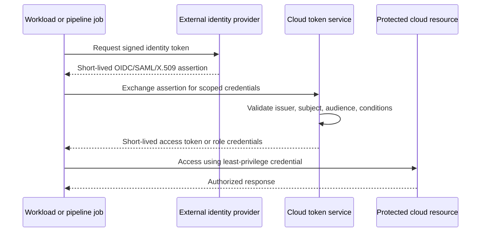

# 身份、机密和工作负载身份联合标准

## 目的

该标准定义了如何在 Azure、AWS、GCP 和 OCI 中创建、授权、使用、轮换、监控和停用员工身份、工作负载身份、机密、证书和加密凭证。

首选设计是无机密身份验证：工作负载提供平台身份或外部发出的 OIDC/SAML/X.509 断言，并接收仅限于特定角色和受众的短期凭证。

## 规范语言

关键字 **MUST**、**MUST NOT**、**REQUIRED**、**SHOULD**、**SHOULD NOT** 和 **MAY** 是规范性的：

- **MUST / MUST NOT**：对于范围内的平台和工作负载是强制性的。
- **SHOULD / SHOULD NOT**：预期，除非基于风险的例外情况得到批准。
- **MAY**：可选，根据工作负载需求选择。

当云提供商功能无法直接实现需求时，实现 MUST 提供等效控制并在架构决策记录（ADR）中记录等效性。

## 身份原则

1. **每个安全边界一个身份。** 不要在不相关的应用、环境或信任区域之间共享身份。
2. **短期优于静态。** 联合、托管身份、角色和临时令牌优于长期机密。
3. **最小特权和明确受众。** 信任策略和授权策略是分开的，且范围 MUST 足够窄。
4. **机密是托管资产。** 机密具有所有者、用途、轮换机制、到期日和使用清单。
5. **人员和工作负载身份不同。** 用户账户 MUST NOT 用作服务账户。
6. **break-glass 是例外。** 紧急通道在使用后被隔离、监控、测试和审查。

## 强制性要求

|要求 |控制语句|最低限度的证据|
|---|---|---|
| `SBP-06-REQ-001` |员工访问 MUST 使用集中式联合，MUST NOT 依靠非托管本地云用户进行日常访问。 |联合配置和本地用户清单 |
| `SBP-06-REQ-002` |每个工作负载 MUST 有适合其应用、环境和权限边界的独特非人类身份。 |身份到工作负载清单 |
| `SBP-06-REQ-003` |在支持的情况下，MUST 使用托管身份、实例/资源主体、服务账户或联合角色。 |认证配置|
| `SBP-06-REQ-004` | CI/CD 系统 MUST 使用 OIDC 或等效工作负载身份联合来获取短期云凭证。 |信任关系和流水线配置|
| `SBP-06-REQ-005` |联合信任 MUST 限制发布者、主题、受众、仓库/项目、分支或环境以及其他可用声明。 |信任策略审查 |
| `SBP-06-REQ-006` |授权 MUST 在最窄的实际资源范围内授予最少的权限。 |有效权限分析|
| `SBP-06-REQ-007` |长期访问密钥和客户端机密 MUST 禁止用于新工作负载，除非不存在受支持的替代方案并且批准了例外。 |凭证清单和例外 |
| `SBP-06-REQ-008` |机密 MUST 仅存储在批准的托管机密存储中，MUST NOT 存储在源、镜像、没有 Vault 支持的流水线变量或通用配置存储中。 |机密扫描和 Vault 清单|
| `SBP-06-REQ-009` |机密和证书 MUST 记录所有者、消费者、轮换程序、到期监控和撤销程序。 |凭证目录和告警 |
| `SBP-06-REQ-010` |机密检索 MUST 记录，并 MUST 监视异常或批量访问。 |审计日志路由和告警规则|
| `SBP-06-REQ-011` |证书 MUST 使用批准的发布者、密钥大小、算法、名称、生命周期和自动续订（如果可行）。 |证书清单及策略|
| `SBP-06-REQ-012` |在平台支持和操作要求允许的情况下，私钥 MUST 不可导出。 |关键配置|
| `SBP-06-REQ-013` |break-glass 身份 MUST 仅应用于云或以其他方式对主要联合故障具有弹性，受到严格保护，并以受控频率进行测试。 |break-glass 测试和访问日志 |
| `SBP-06-REQ-014` |休眠身份、未使用凭据和过多的角色分配 MUST 按照定义的时间表审查并删除。 |访问审核结果 |
| `SBP-06-REQ-015` |生产环境中的身份和机密变更 MUST 可通过职责分离进行审核和保护。 |变更及审批日志记录|

## 工作负载身份联合模式

## 详细执行标准

### 身份分类

企业身份清单 MUST 区分：

- 员工身份；
- 特权管理身份；
- 工作负载身份；
- 部署身份；
- 第三方或合作伙伴身份；
- 紧急身份；和
- 平台管理的服务身份。

身份命名和元数据 MUST 包括所有者、环境、工作负载、权限目的、身份验证方法和审核日期。

### 联邦信任设计

广泛的信任策略可以击败最小权限授权。信任 MUST 与稳定声明绑定。对于 GitHub Actions、GitLab、Kubernetes 或其他发布者，请信任 SHOULD 约束组织/组、仓库/项目、环境、分支/标签、命名空间和服务账户是否可用。通配符 MUST 被最小化并合理化。

令牌受众 MUST 识别预期的令牌交换或依赖方。为一个受众发布的令牌 MUST NOT 被另一受众接受。时钟同步和令牌生命周期控制 MUST 进行监控。

### 机密生命周期

机密 MUST 通过批准的配置流程进入环境，而不是手动复制和粘贴。当消费者无法自动切换时，轮换 SHOULD 自动化，并且 MUST 支持重叠。在所有消费者都采用新版本并且旧版本被撤销之前，轮换过程是不完整的。

应用 SHOULD 在运行时检索机密或通过短期注入机制接收它们。MUST NOT 将机密写入日志、故障转储、命令历史记录、Terraform 输出、容器层或支持票证中。

### 证书和机器信任

证书颁发 SHOULD 与企业 PKI 或经批准的托管证书服务集成。到期监控 MUST 为修复提供充足的准备时间。生产服务 SHOULD 使用自动更新和部署。相互 TLS 身份范围 MUST 仅限于服务和环境，并且必须是可撤销的。

### 访问评论

高权限工作负载角色的审查频率 MUST 高于低风险只读角色。评论 MUST 检查实际使用，而不仅仅是分配。如果以后需要，可以删除未使用的权限 SHOULD 并通过代码重新创建。

## 多云实施映射

|能力|Azure|AWS | GCP |OCI |
|---|---|---|---|---|
|原生工作负载身份 |托管身份/内部工作负载 ID | IAM 角色、STS、Web 身份 |服务账户和工作负载身份联合|实例主体、资源主体、工作负载身份主体 |
| CI 联邦| Entra 联邦身份凭证 | OIDC 提供商和角色信任 |工作负载身份池/提供商 |支持的 OIDC 联合模式或 OCI principals |
|机密存储|Key Vault | Secrets Manager / Systems Manager 参数存储 |Secrets Manager|Vault |
|密钥和证书服务 | Key Vault / Managed HSM / managed certificates | KMS / CloudHSM / ACM |Cloud KMS / Cloud HSM / Certificate Manager |Vault / Certificates |
|访问审核工具 | Entra 访问审查和 Azure Activity Log | IAM 访问分析器、CloudTrail |策略分析器、Cloud Audit Logs | IAM 策略审查、审计 |
提供商产品是实施示例，而不是规范要求的豁免。当满足相同的控制目标时，MAY 使用等效服务。

## 验证

|测量 |目标或解释 |
|---|---|
|静态凭证计数 |长期工作负载密钥和机密；支持场景的目标为零。 |
|凭证过期风险 |凭证在定义的续订窗口内到期而未成功续订。 |
|未使用的权限 |复习期间未使用的作业。 |
|联邦信任广度 |使用广泛通配符或不受约束主题的信任策略。 |
|机密曝光事件|来源、日志、镜像或票据中已确认的机密；目标为零。 |

## 采用清单

- [ ] 对人员和工作负载身份进行分类和盘点。
- [ ] 为每个信任边界创建一个工作负载身份。
- [ ] 为 CI/CD 实施 OIDC 或等效联盟。
- [ ] 限制发布者、主题、受众和环境声明。
- [ ] 将机密和密钥存储在托管 Vault 中。
- [ ] 自动轮换和证书更新。
- [ ] 记录机密访问和高风险身份更改。
- [ ] 查看未使用的身份和权限。
- [ ] 测试和审核 break-glass 访问。

## 保障性证据

证据 MUST 可根据企业日志保留计划进行复制和保留。可接受的证据包括：

- 版本控制的配置和策略；
- 流水线日志和批准记录；
- 策略评估结果；
- 配置快照或清单导出；
- 测试和恢复报告；
- 带有查询定义的仪表板；和
- 批准的 ADR 和例外日志记录。

当机器可读证据可用时，仅 SHOULD NOT 屏幕截图可被视为主要证据。

## 治理、例外和执行

云卓越中心负责该标准。平台工程、安全性、可靠性、应用、数据和 FinOps 团队负责在其范围内实施控制。

例外情况 MUST 满足以下条件：

1. 识别未满足的需求 ID；
2. 描述业务合理性和量化风险；
3. 定义补偿性控制；
4. 指定一名负责任的所有者；
5. 包含不超过180天的有效期；和
6. 经控制所有者和相关风险主管部门批准。

过期的例外是不合规的。自动策略检查 SHOULD 阻止新的不合规部署。现有不合规项 MUST 通过修复积压、负责人和截止日期进行跟踪。

## 审核周期

本文件 MUST 至少每年审查一次，并且在云提供商能力、监管义务、企业风险承受能力或运营模式发生重大变化之后进行审查。更改 MUST 保留需求标识符，而底层控制意图保持不变。

## 相关主题

- [备份、恢复和弹性标准](backup-recovery-and-resilience-standard.md)
- [CI/CD 流水线与发布控制标准](ci-cd-pipeline-and-release-control-standard.md)
- [云安全和零信任标准](cloud-security-and-zero-trust-standard.md)

## 参考文档
- [Azure 托管标识最佳实践建议](https://learn.microsoft.com/entra/identity/managed-identities-azure-resources/managed-identity-best-practice-recommendations)
- [AWS IAM 安全最佳实践](https://docs.aws.amazon.com/IAM/latest/UserGuide/best-practices.html)
- [GCP 工作负载联邦身份验证最佳实践](https://cloud.google.com/iam/docs/best-practices-for-using-workload-identity-federation)
- [OCI instance principals](https://docs.oracle.com/en-us/iaas/Content/Identity/callresources/callingservicesfrominstances.htm)
- [NIST SP 800-63 数字身份指南](https://pages.nist.gov/800-63-4/)
- [Microsoft Azure Well-Architected Framework](https://learn.microsoft.com/azure/well-architected/)
- [AWS Well-Architected Framework](https://docs.aws.amazon.com/wellarchitected/latest/framework/welcome.html)
- [GCP Well-Architected Framework](https://cloud.google.com/architecture/framework)
- [OCI Cloud Adoption Framework](https://docs.oracle.com/en-us/iaas/Content/cloud-adoption-framework/home.htm)
