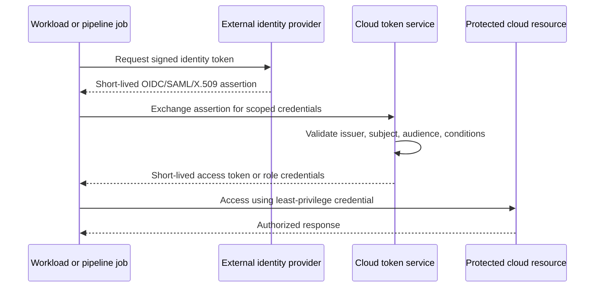

# Identity, Secrets, and Workload Federation Standard

## Purpose

This standard defines how workforce identities, workload identities, secrets, certificates, and cryptographic credentials are created, authorized, used, rotated, monitored, and retired across Azure, AWS, GCP, and OCI.

The preferred design is secretless authentication: a workload presents a platform identity or an externally issued OIDC/SAML/X.509 assertion and receives short-lived credentials scoped to a specific role and audience.

## Normative language

The key words **MUST**, **MUST NOT**, **REQUIRED**, **SHOULD**, **SHOULD NOT**, and **MAY** are normative:

- **MUST / MUST NOT**: mandatory for in-scope platforms and workloads.
- **SHOULD / SHOULD NOT**: expected unless a documented risk-based exception is approved.
- **MAY**: optional and selected according to workload requirements.

Where a cloud-provider feature cannot implement a requirement directly, the implementation MUST provide an equivalent control and record the equivalence in the architecture decision record (ADR).

## Identity principles

1. **One identity per security boundary.** Do not share identities across unrelated applications, environments, or trust zones.
2. **Short-lived over static.** Federation, managed identities, roles, and temporary tokens are preferred to long-lived secrets.
3. **Least privilege and explicit audience.** Trust policy and authorization policy are separate and both MUST be narrow.
4. **Secrets are managed assets.** A secret has an owner, purpose, rotation mechanism, expiry, and usage inventory.
5. **Human and workload identities are distinct.** User accounts MUST NOT be used as service accounts.
6. **Break-glass is exceptional.** Emergency access is isolated, monitored, tested, and reviewed after use.

## Mandatory requirements

| Requirement | Control statement | Minimum evidence |
|---|---|---|
| `SBP-06-REQ-001` | Workforce access MUST use centralized federation and MUST NOT rely on unmanaged local cloud users for routine access. | Federation configuration and local-user inventory |
| `SBP-06-REQ-002` | Every workload MUST have a distinct non-human identity appropriate to its application, environment, and privilege boundary. | Identity-to-workload inventory |
| `SBP-06-REQ-003` | Managed identity, instance/resource principal, service account, or federated role MUST be used where supported. | Authentication configuration |
| `SBP-06-REQ-004` | CI/CD systems MUST use OIDC or equivalent workload federation to obtain short-lived cloud credentials. | Trust relationship and pipeline configuration |
| `SBP-06-REQ-005` | Federation trust MUST restrict issuer, subject, audience, repository/project, branch or environment, and other available claims. | Trust policy review |
| `SBP-06-REQ-006` | Authorization MUST grant least privilege at the narrowest practical resource scope. | Effective-permission analysis |
| `SBP-06-REQ-007` | Long-lived access keys and client secrets MUST be prohibited for new workloads unless no supported alternative exists and an exception is approved. | Credential inventory and exception |
| `SBP-06-REQ-008` | Secrets MUST be stored only in approved managed secret stores and MUST NOT be stored in source, images, pipeline variables without vault backing, or general configuration stores. | Secret scan and vault inventory |
| `SBP-06-REQ-009` | Secrets and certificates MUST have documented owners, consumers, rotation procedures, expiry monitoring, and revocation procedures. | Credential catalog and alerts |
| `SBP-06-REQ-010` | Secret retrieval MUST be logged, and anomalous or bulk access MUST be monitored. | Audit-log routing and alert rules |
| `SBP-06-REQ-011` | Certificates MUST use approved issuers, key sizes, algorithms, names, lifetimes, and automated renewal where feasible. | Certificate inventory and policy |
| `SBP-06-REQ-012` | Private keys MUST be non-exportable where platform support and operational requirements allow. | Key configuration |
| `SBP-06-REQ-013` | Break-glass identities MUST be cloud-only or otherwise resilient to primary federation failure, strongly protected, and tested at a controlled frequency. | Break-glass test and access log |
| `SBP-06-REQ-014` | Dormant identities, unused credentials, and excessive role assignments MUST be reviewed and removed on a defined schedule. | Access review results |
| `SBP-06-REQ-015` | Identity and secret changes in production MUST be auditable and protected by separation of duties. | Change and approval record |

## Workload federation pattern

## Detailed implementation standard

### Identity taxonomy

The enterprise identity inventory MUST distinguish:

- workforce identities;
- privileged administrative identities;
- workload identities;
- deployment identities;
- third-party or partner identities;
- emergency identities; and
- platform-managed service identities.

Identity naming and metadata MUST include owner, environment, workload, privilege purpose, authentication method, and review date.

### Federation trust design

A broad trust policy can defeat least-privilege authorization. Trust MUST bind to stable claims. For GitHub Actions, GitLab, Kubernetes, or another issuer, trust SHOULD constrain organization/group, repository/project, environment, branch/tag, namespace, and service account as available. Wildcards MUST be minimized and justified.

The token audience MUST identify the intended token exchange or relying party. Tokens issued for one audience MUST NOT be accepted for another. Clock synchronization and token lifetime controls MUST be monitored.

### Secret lifecycle

A secret MUST enter the environment through an approved provisioning process, not manual copy-and-paste. Rotation SHOULD be automated and MUST support overlap when consumers cannot switch atomically. A rotation process is incomplete until all consumers have adopted the new version and the old version is revoked.

Applications SHOULD retrieve secrets at runtime or receive them through a short-lived injection mechanism. Secrets MUST NOT be written to logs, crash dumps, command history, Terraform outputs, container layers, or support tickets.

### Certificates and machine trust

Certificate issuance SHOULD integrate with enterprise PKI or an approved managed certificate service. Expiry monitoring MUST provide sufficient lead time for remediation. Production services SHOULD use automated renewal and deployment. Mutual TLS identities MUST be scoped to the service and environment and must be revocable.

### Access reviews

High-privilege workload roles MUST be reviewed more frequently than low-risk read-only roles. Reviews MUST examine actual use, not just assignment. Unused privileges SHOULD be removed and recreated through code if later required.

## Multi-cloud implementation mapping

| Capability | Azure | AWS | GCP | OCI |
|---|---|---|---|---|
| Native workload identity | Managed Identity / Entra Workload ID | IAM roles, STS, web identity | Service accounts and Workload Identity Federation | Instance principals, resource principals, workload identity principals |
| CI federation | Entra federated identity credential | OIDC provider and role trust | Workload Identity Pool/Provider | OIDC federation patterns or OCI principals where supported |
| Secret store | Key Vault | Secrets Manager / Systems Manager Parameter Store | Secret Manager | Vault |
| Key and certificate service | Key Vault / Managed HSM / managed certificates | KMS / CloudHSM / ACM | Cloud KMS / Cloud HSM / Certificate Manager | Vault / Certificates |
| Access review tooling | Entra access reviews and Azure activity logs | IAM Access Analyzer, CloudTrail | Policy Analyzer, Cloud Audit Logs | IAM policy review, Audit |

Provider products are implementation examples, not exemptions from the normative requirements. Equivalent services MAY be used when they satisfy the same control objective.

## Validation

| Measure | Target or interpretation |
|---|---|
| Static credential count | Long-lived workload keys and secrets; target zero for supported scenarios. |
| Credential expiry risk | Credentials expiring inside the defined renewal window without a successful renewal. |
| Unused privilege | Assignments unused during the review window. |
| Federation trust breadth | Trust policies using broad wildcards or unconstrained subjects. |
| Secret exposure events | Confirmed secrets in source, logs, images, or tickets; target zero. |

## Adoption checklist

- [ ] Classify and inventory human and workload identities.
- [ ] Create one workload identity per trust boundary.
- [ ] Implement OIDC or equivalent federation for CI/CD.
- [ ] Constrain issuer, subject, audience, and environment claims.
- [ ] Store secrets and keys in managed vaults.
- [ ] Automate rotation and certificate renewal.
- [ ] Log secret access and high-risk identity changes.
- [ ] Review unused identities and privilege.
- [ ] Test and audit break-glass access.

## Assurance evidence

Evidence MUST be reproducible and retained according to the enterprise records schedule. Acceptable evidence includes:

- version-controlled configuration and policy;
- pipeline logs and approval records;
- policy evaluation results;
- configuration snapshots or inventory exports;
- test and recovery reports;
- dashboards with query definitions; and
- approved ADRs and exception records.

Screenshots alone SHOULD NOT be treated as primary evidence when machine-readable evidence is available.

## Governance, exceptions, and enforcement

The Cloud Center of Excellence owns this standard. Platform engineering, security, reliability, application, data, and FinOps teams are accountable for implementing controls within their scope.

Exceptions MUST:

1. identify the unmet requirement ID;
2. describe business justification and quantified risk;
3. define compensating controls;
4. name an accountable owner;
5. include an expiry date not exceeding 180 days; and
6. be approved by the control owner and the relevant risk authority.

Expired exceptions are non-compliant. Automated policy checks SHOULD block new non-compliant deployments. Existing non-compliance MUST be tracked through a remediation backlog with owners and due dates.

## Review cycle

This document MUST be reviewed at least annually and after a material change to cloud-provider capabilities, regulatory obligations, enterprise risk tolerance, or the operating model. Changes MUST preserve requirement identifiers where the underlying control intent remains unchanged.

## Related topics

- [Backup, Recovery, and Resilience Standard](backup-recovery-and-resilience-standard.md)
- [CI/CD Pipeline and Release-Control Standard](ci-cd-pipeline-and-release-control-standard.md)
- [Cloud Security and Zero-Trust Standard](cloud-security-and-zero-trust-standard.md)

## References

- [Azure managed identity best-practice recommendations](https://learn.microsoft.com/entra/identity/managed-identities-azure-resources/managed-identity-best-practice-recommendations)
- [AWS IAM security best practices](https://docs.aws.amazon.com/IAM/latest/UserGuide/best-practices.html)
- [GCP Workload Identity Federation best practices](https://cloud.google.com/iam/docs/best-practices-for-using-workload-identity-federation)
- [OCI instance principals](https://docs.oracle.com/en-us/iaas/Content/Identity/callresources/callingservicesfrominstances.htm)
- [NIST SP 800-63 Digital Identity Guidelines](https://pages.nist.gov/800-63-4/)
- [Microsoft Azure Well-Architected Framework](https://learn.microsoft.com/azure/well-architected/)
- [AWS Well-Architected Framework](https://docs.aws.amazon.com/wellarchitected/latest/framework/welcome.html)
- [GCP Well-Architected Framework](https://cloud.google.com/architecture/framework)
- [OCI Cloud Adoption Framework](https://docs.oracle.com/en-us/iaas/Content/cloud-adoption-framework/home.htm)
