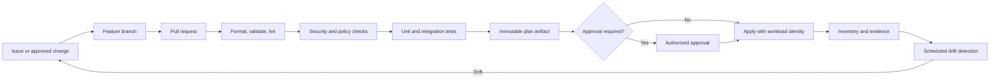

# 基础设施即代码工程标准

## 目的

该标准建立了通过代码配置和更改云基础设施的最低工程控制。它应用于 Terraform、OpenTofu、Bicep、ARM 模板、AWS CloudFormation、AWS CDK、GCP Deployment Manager migration、GCP Infrastructure Manager、OCI Resource Manager 和类似的声明性工具。

目标状态是一个受控、可重复、可审计的交付系统，其中通过自动化对基础设施变更进行审查、测试、策略检查和晋级。直接更改控制台是紧急行动，而不是正常的交付机制。

## 规范语言

关键字 **MUST**、**MUST NOT**、**REQUIRED**、**SHOULD**、**SHOULD NOT** 和 **MAY** 是规范性的：

- **MUST / MUST NOT**：对于范围内的平台和工作负载是强制性的。
- **SHOULD / SHOULD NOT**：预期，除非基于风险的例外情况得到批准。
- **MAY**：可选，根据工作负载需求选择。

在云提供程序功能无法直接实现需求的情况下，实现 MUST 提供等效控制并在架构决策记录（ADR）中记录等效性。

## 工程原则

1. **代码是权威意图。** 部署的资源 MUST 可追溯到版本控制的定义。
2. **在执行之前审查更改。** MUST 在生产变更执行前评估生成的计划或等效变更集。
3. **自动化使用短期身份。** 流水线 MUST 使用联合或平台工作负载身份而不是嵌入式凭据。
4. **状态作为敏感的运营数据受到保护。** 状态、计划、日志和制品 MUST 受到访问控制和加密保护。
5. **测试和策略门将故障左移。** 语法、安全性、合规性和行为检查 MUST 在部署之前运行。
6. **故意检测并解决漂移。** 未经批准的漂移 MUST 与代码协调，或正式纳入代码。

## 强制性要求

|要求 |控制语句|最低限度的证据|
|---|---|---|
| `SBP-01-REQ-001` |所有持久云基础设施 MUST 通过版本控制代码定义，除非记录在案的服务限制阻止它。 |仓库路径、资源到代码清单、已批准的例外 |
| `SBP-01-REQ-002` |生产变更 MUST 源自已批准的拉取请求或等效的已审核变更记录。 | PR 审查历史记录和受保护分支配置 |
| `SBP-01-REQ-003` |交付工作流程 MUST 在应用之前生成非破坏性计划或变更集，并且 MUST 保留计划和变更记录。 |计划制品和流水线日志 |
| `SBP-01-REQ-004` |生产应用 MUST 使用审核后的计划制品；禁止在应用期间重新生成未经审查的计划。 |制品摘要和应用日志 |
| `SBP-01-REQ-005` |远程状态 MUST 经过加密、访问控制和（如果支持）版本控制，并通过锁定或等效并发机制进行保护。 |后台配置及访问策略|
| `SBP-01-REQ-006` |状态和计划文件 MUST 被视为敏感文件，因为它们可以包含标识符、拓扑和机密信息。 |数据分类和存储控制|
| `SBP-01-REQ-007` | IaC 仓库 MUST 运行适合更改的格式化、验证、linting、安全扫描、策略即代码和自动化测试。 |必要的检查和测试结果|
| `SBP-01-REQ-008` |提供程序和模块版本 MUST 受约束；在支持时 MUST 提交依赖项锁定文件。 |版本限制和锁定文件|
| `SBP-01-REQ-009` |流水线身份验证 MUST 使用短期联合或托管工作负载凭据。除经批准的例外情况外，禁止使用静态云访问密钥。 |联合配置和凭证清单 |
| `SBP-01-REQ-010` |生产和非生产环境 MUST 使用单独的状态，SHOULD 根据爆炸半径要求使用单独的云账户、订阅、项目或隔间。 |状态布局和资源层次结构|
| `SBP-01-REQ-011` |通过定期漂移检查和调查可检测到对托管资源 MUST 手动更改。 |漂移报告和修复票 |
| `SBP-01-REQ-012` |破坏性变更 MUST 有明确批准且记录在案的恢复或替换策略。 |审批日志记录和回滚/恢复部分|
| `SBP-01-REQ-013` | IaC 输出 MUST 仅暴露稳定的引用值，而 MUST NOT 暴露机密。 |输出定义和扫描结果|
| `SBP-01-REQ-014` |导入、状态移动和状态删除操作 MUST 在执行前进行同行评审和备份。 |操作手册、审批和状态备份 |
| `SBP-01-REQ-015` |每个生产部署 MUST 生成一个不可变的日志记录，其中包含源修订、参与者、环境、计划摘要、结果和时间戳。 |部署清单或证明|

## 参考交付流程

## 详细执行标准

### 源代码和仓库控制

默认分支 MUST 受到保护。合并前所需的检查 MUST 通过。强制推送 MUST 被禁用，并禁止删除受保护分支。代码所有者或等效机制 SHOULD 要求平台所有者对共享基础设施进行审查，并要求对特权身份、公开曝光、加密或策略控制的更改进行安全审查。

生成的制品 MUST 标识源提交。构建脚本 MUST 在实用的范围内具有确定性。工具安装 SHOULD 使用固定版本和校验和验证，而不是下载不受约束的最新版本。

### 状态和环境隔离

状态对象 MUST 具有狭义定义的所有权边界。不相关的工作负载 MUST NOT 共享一个状态只是为方便。状态分离 SHOULD 与生命周期、访问边界、爆炸半径和部署节奏保持一致。

状态后端 MUST 拒绝公共访问。管理访问 SHOULD 使用特权访问管理和即时提升。 break-glass 状态操作 MUST 记录并在使用后进行审查。

### 测试层次结构

最小的测试层次结构是：

1. 格式化和解析；
2. 提供程序和模式验证；
3.静态分析和安全扫描；
4. 策略即代码评估；
5. 支持的模块单元测试或模拟测试；
6. 在隔离的账户或项目中部署并验证高风险模块的测试；和
7. 部署后冒烟测试。

测试 MUST 验证成功的创建和重大失效模式。身份、网络路由、加密、备份和组织级策略等高风险基础设施 SHOULD 进行集成测试。

### 漂移和紧急变化

紧急控制台变更 MAY 用于稳定事件。操作员 MUST 记录变更、范围、原因和预计持续时间。所属团队 MUST 将更改协调为代码或在事件后续窗口内将其恢复。禁止默默接受漂移。

### 安全变更设计

模块和根配置 SHOULD 有利于附加、向后兼容的更改。重命名和移动 MUST 尽可能使用受支持的状态移动机制。强制更换有状态资源的变更 MUST 在批准之前确定数据迁移、停机时间、回滚限制和恢复步骤。

## 多云实施映射

|能力|Azure|AWS | GCP |OCI |
|---|---|---|---|---|
|原生声明式引擎 |ARM/Bicep； Azure Verified Modules |CloudFormation/CDK |Infrastructure Manager；Config Connector|Resource Manager|
|远程状态示例 |具有私有访问和锁定模式的 Azure Storage | S3 具有版本控制和 DynamoDB/S3 锁定（如果适用）|具有版本控制和锁定策略的 Cloud Storage|对象存储或托管 Resource Manager 状态 |
|策略门| Azure Policy； PSRule for Azure | AWS Config；CloudFormation Guard；Organizations policies |Organization Policy；Policy Controller|Cloud Guard；Security Zones； IAM policies |
|工作负载身份|管理身份；内部工作负载身份联合| IAM 与 STS 和 OIDC 的角色 |工作负载身份联合；服务账户模拟 |实例、资源或工作负载主体 |
|清单和漂移| Azure Resource Graph；Deployment Stacks | AWS Config； CloudFormation 漂移检测 |Cloud Asset Inventory| OCI Search；Cloud Guard；Resource Manager 漂移功能|

提供程序产品是实施示例，而不是规范要求的豁免。当满足相同的控制目标时，MAY 使用等效服务。

## 验证

|测量 |目标或解释 |
|---|---|
| IaC 覆盖范围 |映射到权威仓库的持久生产资源的百分比；目标 100%（经批准的排除项目除外）。 |
|未经批准的漂移年龄|从检测到和解的时间；关键漂移应在定义的事件或变更 SLA 内解决。 |
|变更失败率|需要回滚、紧急修复或事件响应的部署百分比。 |
|策略逃逸率|尽管有预防性控制，但仍创建的不合规资源的数量。 |
|静态凭证计数 |流水线到云身份验证的目标为零。 |

## 采用清单

- [ ] 保护默认分支并要求同行评审。
- [ ] 配置加密、私有、访问控制的远程状态。
- [ ] 固定工具、提供程序和模块版本。
- [ ] 实施应用前计划并保持制品完整性。
- [ ] 启用流水线的工作负载身份联合。
- [ ] 对每个更改运行验证、扫描、策略和测试。
- [ ] 安排漂移检测并分配修复所有权。
- [ ] 采集部署证据和制品摘要。

## 保障性证据

证据 MUST 可根据企业日志保留计划进行复制和保留。可接受的证据包括：

- 版本控制的配置和策略；
- 流水线日志和批准记录；
- 策略评估结果；
- 配置快照或清单导出；
- 测试和恢复报告；
- 带有查询定义的仪表板；和
- 批准的 ADR 和例外日志记录。

当机器可读证据可用时，仅 SHOULD NOT 屏幕截图可被视为主要证据。

## 治理、例外和执行

云卓越中心负责该标准。平台工程、安全性、可靠性、应用、数据和 FinOps 团队负责在其范围内实施控制。

例外情况 MUST 满足以下条件：

1. 识别未满足的需求 ID；
2. 描述业务合理性和量化风险；
3. 定义补偿性控制；
4. 指定一名负责任的所有者；
5. 包含不超过180天的有效期；和
6. 经控制所有者和相关风险主管部门批准。

过期的例外是不合规的。自动策略检查 SHOULD 阻止新的不合规部署。现有不合规项 MUST 通过修复积压、负责人和截止日期进行跟踪。

## 审核周期
本文件 MUST 至少每年审查一次，并且在云提供程序能力、监管义务、企业风险承受能力或运营模式发生重大变化之后进行审查。更改 MUST 保留需求标识符，而底层控制意图保持不变。

## 相关主题

- [Terraform 模块设计标准](terraform-module-design-standard.md)
- [CI/CD 流水线与发布控制标准](ci-cd-pipeline-and-release-control-standard.md)
- [备份、恢复和弹性标准](backup-recovery-and-resilience-standard.md)

## 参考文档

- [Terraform 配置语言风格指南](https://developer.hashicorp.com/terraform/language/style)
- [Terraform 推荐做法](https://developer.hashicorp.com/terraform/cloud-docs/recommended-practices)
- [Terraform 依赖锁定文件](https://developer.hashicorp.com/terraform/language/files/dependency-lock)
- [NIST 安全软件开发框架，SP 800-218](https://csrc.nist.gov/pubs/sp/800/218/final)
- [Microsoft Azure Well-Architected Framework](https://learn.microsoft.com/azure/well-architected/)
- [AWS Well-Architected Framework](https://docs.aws.amazon.com/wellarchitected/latest/framework/welcome.html)
- [GCP Well-Architected Framework](https://cloud.google.com/architecture/framework)
- [OCI Cloud Adoption Framework](https://docs.oracle.com/en-us/iaas/Content/cloud-adoption-framework/home.htm)
