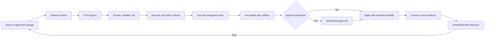

# Infrastructure as Code Engineering Standard

## Purpose

This standard establishes the minimum engineering controls for provisioning and changing cloud infrastructure through code. It applies to Terraform, OpenTofu, Bicep, ARM templates, AWS CloudFormation, AWS CDK, GCP Deployment Manager migrations, GCP Infrastructure Manager, OCI Resource Manager, and comparable declarative tooling.

The target state is a controlled, repeatable, auditable delivery system in which infrastructure changes are reviewed, tested, policy-checked, and promoted through automation. Direct console changes are emergency actions, not a normal delivery mechanism.

## Normative language

The key words **MUST**, **MUST NOT**, **REQUIRED**, **SHOULD**, **SHOULD NOT**, and **MAY** are normative:

- **MUST / MUST NOT**: mandatory for in-scope platforms and workloads.
- **SHOULD / SHOULD NOT**: expected unless a documented risk-based exception is approved.
- **MAY**: optional and selected according to workload requirements.

Where a cloud-provider feature cannot implement a requirement directly, the implementation MUST provide an equivalent control and record the equivalence in the architecture decision record (ADR).

## Engineering principles

1. **Code is the authoritative intent.** Deployed resources MUST be traceable to version-controlled definitions.
2. **Changes are reviewed before execution.** A generated plan or equivalent change set MUST be evaluated before production mutation.
3. **Automation uses short-lived identity.** Pipelines MUST use federation or platform workload identity instead of embedded credentials.
4. **State is protected as sensitive operational data.** State, plans, logs, and artifacts MUST be access-controlled and encrypted.
5. **Tests and policy gates shift failure left.** Syntax, security, compliance, and behavioral checks MUST run before deployment.
6. **Drift is detected and resolved deliberately.** Unapproved drift MUST be reconciled to code or formally adopted into code.

## Mandatory requirements

| Requirement | Control statement | Minimum evidence |
|---|---|---|
| `SBP-01-REQ-001` | All persistent cloud infrastructure MUST be defined through version-controlled code unless a documented service limitation prevents it. | Repository path, resource-to-code inventory, approved exception |
| `SBP-01-REQ-002` | Production changes MUST originate from an approved pull request or equivalent reviewed change record. | PR review history and protected-branch configuration |
| `SBP-01-REQ-003` | The delivery workflow MUST generate a non-destructive plan or change set before apply and MUST retain the plan with the change record. | Plan artifact and pipeline log |
| `SBP-01-REQ-004` | Production apply MUST use the reviewed plan artifact; regenerating an unreviewed plan during apply is prohibited. | Artifact digest and apply log |
| `SBP-01-REQ-005` | Remote state MUST be encrypted, access-controlled, versioned where supported, and protected by locking or an equivalent concurrency mechanism. | Backend configuration and access policy |
| `SBP-01-REQ-006` | State and plan files MUST be treated as sensitive because they can contain identifiers, topology, and secret material. | Data classification and storage controls |
| `SBP-01-REQ-007` | IaC repositories MUST run formatting, validation, linting, security scanning, policy-as-code, and automated tests appropriate to the change. | Required checks and test results |
| `SBP-01-REQ-008` | Provider and module versions MUST be constrained; dependency lock files MUST be committed when supported. | Version constraints and lock file |
| `SBP-01-REQ-009` | Pipeline authentication MUST use short-lived federated or managed workload credentials. Static cloud access keys are prohibited except by approved exception. | Federation configuration and credential inventory |
| `SBP-01-REQ-010` | Production and non-production environments MUST use separate state and SHOULD use separate cloud accounts, subscriptions, projects, or compartments according to blast-radius requirements. | State layout and resource hierarchy |
| `SBP-01-REQ-011` | Manual changes to managed resources MUST be detected through scheduled drift checks and investigated. | Drift report and remediation ticket |
| `SBP-01-REQ-012` | Destructive changes MUST require explicit approval and a documented recovery or replacement strategy. | Approval record and rollback/recovery section |
| `SBP-01-REQ-013` | IaC outputs MUST expose only stable integration values and MUST NOT expose secrets. | Output definitions and scan results |
| `SBP-01-REQ-014` | Import, state move, and state removal operations MUST be peer-reviewed and backed up before execution. | Runbook, approval, and state backup |
| `SBP-01-REQ-015` | Every production deployment MUST produce an immutable record containing source revision, actor, environment, plan digest, result, and timestamps. | Deployment manifest or attestation |

## Reference delivery flow

## Detailed implementation standard

### Source and repository controls

The default branch MUST be protected. Required checks MUST pass before merge. Force pushes and deletion of protected branches MUST be disabled. CODEOWNERS or an equivalent mechanism SHOULD require review from the platform owner for shared infrastructure and from security for changes to privileged identity, public exposure, encryption, or policy controls.

Generated artifacts MUST identify the source commit. Build scripts MUST be deterministic to the extent practical. Tool installation SHOULD use pinned versions and checksum verification rather than downloading an unconstrained latest release.

### State and environment isolation

A state object MUST have a narrowly defined ownership boundary. Unrelated workloads MUST NOT share a state merely for convenience. State separation SHOULD align to lifecycle, access boundary, blast radius, and deployment cadence.

State backends MUST deny public access. Administrative access SHOULD use privileged access management and just-in-time elevation. Break-glass state operations MUST be logged and reviewed after use.

### Testing hierarchy

The minimum test hierarchy is:

1. formatting and parsing;
2. provider and schema validation;
3. static analysis and security scanning;
4. policy-as-code evaluation;
5. module unit tests or mocked tests where supported;
6. deploy-and-verify tests in an isolated account or project for high-risk modules; and
7. post-deployment smoke tests.

Tests MUST validate both successful creation and material failure modes. High-risk infrastructure such as identity, network routing, encryption, backup, and organization-level policy SHOULD have integration tests.

### Drift and emergency changes

Emergency console changes MAY be used to stabilize an incident. The operator MUST record the change, scope, reason, and expected duration. The owning team MUST reconcile the change into code or revert it within the incident follow-up window. Silent acceptance of drift is prohibited.

### Safe change design

Modules and root configurations SHOULD favor additive, backward-compatible changes. Renames and moves MUST use supported state-move mechanisms where possible. Changes that force replacement of stateful resources MUST identify data migration, downtime, rollback limits, and recovery steps before approval.

## Multi-cloud implementation mapping

| Capability | Azure | AWS | GCP | OCI |
|---|---|---|---|---|
| Native declarative engine | ARM/Bicep; Azure Verified Modules | CloudFormation/CDK | Infrastructure Manager; Config Connector | Resource Manager |
| Remote state example | Azure Storage with private access and locking pattern | S3 with versioning and DynamoDB/S3 locking as applicable | Cloud Storage with versioning and locking strategy | Object Storage or managed Resource Manager state |
| Policy gate | Azure Policy; PSRule for Azure | AWS Config; CloudFormation Guard; Organizations policies | Organization Policy; Policy Controller | Cloud Guard; Security Zones; IAM policies |
| Workload identity | Managed Identity; Entra workload identity federation | IAM role with STS and OIDC | Workload Identity Federation; service account impersonation | Instance, resource, or workload principals |
| Inventory and drift | Azure Resource Graph; deployment stacks | AWS Config; CloudFormation drift detection | Cloud Asset Inventory | OCI Search; Cloud Guard; Resource Manager drift capabilities |

Provider products are implementation examples, not exemptions from the normative requirements. Equivalent services MAY be used when they satisfy the same control objective.

## Validation

| Measure | Target or interpretation |
|---|---|
| IaC coverage | Percentage of persistent production resources mapped to an authoritative repository; target 100% except approved exclusions. |
| Unapproved drift age | Time from detection to reconciliation; critical drift should be addressed within the defined incident or change SLA. |
| Change failure rate | Percentage of deployments requiring rollback, emergency repair, or incident response. |
| Policy escape rate | Number of non-compliant resources created despite preventive controls. |
| Static credential count | Target zero for pipeline-to-cloud authentication. |

## Adoption checklist

- [ ] Protect default branches and require peer review.
- [ ] Configure encrypted, private, access-controlled remote state.
- [ ] Pin tool, provider, and module versions.
- [ ] Implement plan-before-apply with artifact integrity.
- [ ] Enable workload identity federation for pipelines.
- [ ] Run validation, scanning, policy, and tests on every change.
- [ ] Schedule drift detection and assign remediation ownership.
- [ ] Capture deployment evidence and artifact digests.

## Assurance evidence

Evidence MUST be reproducible and retained according to the enterprise records schedule. Acceptable evidence includes:

- version-controlled configuration and policy;
- pipeline logs and approval records;
- policy evaluation results;
- configuration snapshots or inventory exports;
- test and recovery reports;
- dashboards with query definitions; and
- approved ADRs and exception records.

Screenshots alone SHOULD NOT be treated as primary evidence when machine-readable evidence is available.

## Governance, exceptions, and enforcement

The Cloud Center of Excellence owns this standard. Platform engineering, security, reliability, application, data, and FinOps teams are accountable for implementing controls within their scope.

Exceptions MUST:

1. identify the unmet requirement ID;
2. describe business justification and quantified risk;
3. define compensating controls;
4. name an accountable owner;
5. include an expiry date not exceeding 180 days; and
6. be approved by the control owner and the relevant risk authority.

Expired exceptions are non-compliant. Automated policy checks SHOULD block new non-compliant deployments. Existing non-compliance MUST be tracked through a remediation backlog with owners and due dates.

## Review cycle

This document MUST be reviewed at least annually and after a material change to cloud-provider capabilities, regulatory obligations, enterprise risk tolerance, or the operating model. Changes MUST preserve requirement identifiers where the underlying control intent remains unchanged.

## Related topics

- [Terraform Module Design Standard](terraform-module-design-standard.md)
- [CI/CD Pipeline and Release-Control Standard](ci-cd-pipeline-and-release-control-standard.md)
- [Backup, Recovery, and Resilience Standard](backup-recovery-and-resilience-standard.md)

## References

- [Terraform configuration language style guide](https://developer.hashicorp.com/terraform/language/style)
- [Terraform recommended practices](https://developer.hashicorp.com/terraform/cloud-docs/recommended-practices)
- [Terraform dependency lock file](https://developer.hashicorp.com/terraform/language/files/dependency-lock)
- [NIST Secure Software Development Framework, SP 800-218](https://csrc.nist.gov/pubs/sp/800/218/final)
- [Microsoft Azure Well-Architected Framework](https://learn.microsoft.com/azure/well-architected/)
- [AWS Well-Architected Framework](https://docs.aws.amazon.com/wellarchitected/latest/framework/welcome.html)
- [GCP Well-Architected Framework](https://cloud.google.com/architecture/framework)
- [OCI Cloud Adoption Framework](https://docs.oracle.com/en-us/iaas/Content/cloud-adoption-framework/home.htm)
