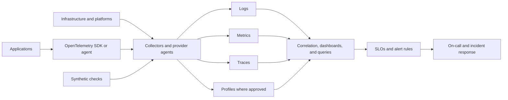

# 日志、监控和可观测性标准

## 目的

该标准定义了云平台和工作负载所需的遥测和操作可见性。它涵盖成熟且合理的日志、指标、跟踪、事件、审计日志、综合检查和配置文件。

监控通过预定义信号回答已知问题。可观测性通过关联整个系统的丰富遥测数据来调查以前未知的故障模式。两者都是必需的；在没有操作问题、所有权和响应路径的情况下收集大量数据是不合规的。

## 规范语言

关键字 **MUST**、**MUST NOT**、**REQUIRED**、**SHOULD**、**SHOULD NOT** 和 **MAY** 是规范性的：

- **MUST / MUST NOT**：对于范围内的平台和工作负载是强制性的。
- **SHOULD / SHOULD NOT**：预期，除非基于风险的例外情况得到批准。
- **MAY**：可选，根据工作负载需求选择。

当云提供商功能无法直接实现需求时，实现 MUST 提供等效控制并在架构决策记录（ADR）中记录等效性。

## 可观测性原则

1. **从服务目标开始。** 遥测和告警 MUST 支持可靠性、安全性、性能和业务成果。
2. **使用通用语义。** 资源、服务、环境、版本、区域和相关标识符 MUST 保持一致。
3. **针对症状和可采取行动的原因发出告警。** 告警 MUST 具有所有者和响应操作。
4. **集中而不产生单一盲点。** 遥测管道 MUST 具有弹性和监控能力。
5. **保护遥测。** 日志可以包含敏感数据，MUST 遵循分类、保留和访问控制。
6. **首选开放式仪器。** OpenTelemetry 或其他便携式语义模型 SHOULD 用于应用遥测。

## 强制性要求

|要求 |控制语句|最低限度的证据|
|---|---|---|
| `SBP-10-REQ-001` |每个生产服务 MUST 定义适合用户可见结果的服务级别指标和目标。 | SLO 文档和仪表板 |
| `SBP-10-REQ-002` |应用 MUST 发出带有时间戳、严重性、服务、环境、版本和相关标识符的结构化日志。 |日志架构示例 |
| `SBP-10-REQ-003` |分布式服务 SHOULD 跨同步和异步边界传播跟踪上下文。 |跟踪查询和仪表测试|
| `SBP-10-REQ-004` |基础设施和托管服务平台指标及日志 MUST 根据已记录在案的遥测配置文件启用。 |诊断配置 |
| `SBP-10-REQ-005` |云控制平面和身份审计日志 MUST 得到集中和保护。 |日志路由和保留|
| `SBP-10-REQ-006` |遥测 MUST 使用同步时间和一致的时区表示，最好是 UTC。 |主机/服务配置|
| `SBP-10-REQ-007` |日志 MUST NOT 包含机密、访问令牌、私钥或不必要的个人数据。 |数据丢失和日志内容扫描|
| `SBP-10-REQ-008` |遥测访问 MUST 遵循最低权限，敏感的审计/安全日志 MUST 受到限制管理。 |准入策略|
| `SBP-10-REQ-009` |告警规则 MUST 包括所有者、严重性、操作手册、评估窗口、抑制行为和升级路由。 |告警目录 |
| `SBP-10-REQ-010` |告警 MUST 在生产使用之前进行测试，并检查噪音、漏检和过时所有权。 |告警测试及审查记录|
| `SBP-10-REQ-011` |高基数维度 MUST 受到控制，以防止成本和性能故障。 |遥测架构和成本报告 |
| `SBP-10-REQ-012` |遥测管道 MUST 监控摄取延迟、丢弃率、队列深度、导出器故障和存储运行状况。 |流水线健康仪表板|
| `SBP-10-REQ-013` |保留 MUST 由遥测类型、操作需求、安全调查、法律义务和成本来定义。 |保留策略 |
| `SBP-10-REQ-014` |仪表板 MUST 识别数据源、查询、所有者、目标受众和新鲜度。 |仪表板元数据 |
| `SBP-10-REQ-015` |综合监控 SHOULD 验证来自相关网络位置的关键用户旅程和依赖性。 |综合测试结果|
| `SBP-10-REQ-016` |事件后审查 MUST 确定遥测差距并跟踪修复措施。 |事件行动项目|

## 参考可观测性流水线

## 详细执行标准

### 遥测分类法

生产服务的最小信号集是：

- 请求、错误、延迟和饱和度指标；
- 应用和平台日志；
- 依赖性健康；
- 部署和配置更改事件；
- 身份和控制平面审计日志；
- 在技术上可行的情况下跟踪分布式请求路径；和
- 解释用户影响所需的业务或服务成果指标。

在隐私、开销和可支持性审查之后使用连续分析 MAY。

### 日志模式

结构化日志 SHOULD 使用机器可读的格式。 常用字段 SHOULD 包括：
```text
timestamp, severity, service.name, service.version, deployment.environment,
cloud.provider, cloud.region, trace_id, span_id, request_id, operation,
outcome, error.type, duration_ms, resource_id
```
自由格式消息文本 MAY 补充结构化字段，但 MUST NOT 成为严重性、服务标识或相关性的唯一来源。

### SLO 和错误预算

SLO MUST 可通过可靠的遥测进行测量，MUST 指定计算窗口、总体、排除和数据源。错误预算 SHOULD 指导发布风险和可靠性投资。没有所有者或决策流程的目标不是可执行的 SLO。

### 告警设计

寻呼告警 SHOULD 表示迫在眉睫或实际的用户影响、安全影响或关键安全裕度耗尽。票证告警 MAY 代表较慢的降级或合规工作。没有可靠队列的仅电子邮件告警不足以应对紧急情况。

告警 MUST 说明数据丢失和遥测管道故障。尽可能聚合每个实例 SHOULD 重复告警以对服务产生影响。

### 遥测成本和保留

团队 MUST 控制详细日志、重复摄取、基数、采样、保留、存档层和跨区域导出。降低成本 MUST NOT 删除安全、恢复或验证 SLO 所需的遥测。采样决策 MUST 根据策略保留错误和高延迟跟踪。

### 运营就绪

在生产发布之前，团队 MUST 演示仪表板、告警测试、待命路由、运行手册、依赖性监控和遥测故障检测。所有权元数据 MUST 与服务目录同步。

## 多云实施映射

|能力|Azure|AWS | GCP |OCI |
|---|---|---|---|---|
|指标和日志 | Azure Monitor、Log Analytics |Cloud Monitoring| Cloud Monitoring 和 Cloud Logging|Monitoring and Logging|
|追踪/APM |Application Insights | X-Ray/Application Signals |Cloud Trace/Application Performance Management|Application Performance Monitoring |
|审计日志| Azure Activity Log 和 Entra 审计/登录日志 | CloudTrail 和服务审计日志 | Cloud Audit Logs|Audit|
|托管收集器 | Azure Monitor Agent / OTel distro | CloudWatch Agent / ADOT | Ops Agent / Google-built OTel Collector |Management Agent / OTel-compatible collectors |
|综合监测| Application Insights 可用性测试 | CloudWatch Synthetics |Cloud Monitoring uptime checks| APM 综合监控或认可服务 |

提供商产品是实施示例，而不是规范要求的豁免。满足相同控制目标时 MAY 使用等效服务。

## 验证

|测量 |目标或解释 |
|---|---|
| SLO 覆盖范围 |具有批准的 SLI/SLO 和当前仪表板的生产服务。 |
|可操作寻呼率 |需要人工处理的寻呼告警百分比；低值表示告警噪音。 |
|遥测摄取延迟 |从事件到查询/告警可用性的端到端时间。 |
|遥测丢失 |收集器、导出器、配额和解析丢失。 |
|身份不明告警 |没有当前响应所有者的告警；目标为零。 |

## 采用清单

- [ ] 定义 SLI、SLO 和决策使用。
- [ ] 仪器日志、指标、跟踪和审核事件。
- [ ] 采用公共资源和相关字段。
- [ ] 防止遥测中的机密和不必要的 PII。
- [ ] 集中并保护控制平面和安全日志。
- [ ] 创建有明确负责人的、经过测试的、可运维的告警规则。
- [ ] 监控遥测管道本身。
- [ ] 设置保留、采样和基数控制。
- [ ] 运行运营就绪和综合测试。

## 保障性证据

证据 MUST 可根据企业日志保留计划进行复制和保留。可接受的证据包括：

- 版本控制的配置和策略；
- 流水线日志和批准记录；
- 策略评估结果；
- 配置快照或清单导出；
- 测试和恢复报告；
- 带有查询定义的仪表板；和
- 批准的 ADR 和例外日志记录。

当机器可读证据可用时，仅 SHOULD NOT 屏幕截图可被视为主要证据。

## 治理、例外和执行

云卓越中心负责该标准。平台工程、安全性、可靠性、应用、数据和 FinOps 团队负责在其范围内实施控制。

例外情况 MUST 满足以下条件：

1. 识别未满足的需求 ID；
2. 描述业务合理性和量化风险；
3. 定义补偿性控制；
4. 指定一名负责任的所有者；
5. 包含不超过180天的有效期；和
6. 经控制所有者和相关风险主管部门批准。

过期的例外是不合规的。自动策略检查 SHOULD 阻止新的不合规部署。现有不合规项 MUST 通过修复积压、负责人和截止日期进行跟踪。

## 审核周期

本文件 MUST 至少每年审查一次，并且在云提供商能力、监管义务、企业风险承受能力或运营模式发生重大变化后进行审查。更改 MUST 保留需求标识符，而底层控制意图保持不变。

## 相关主题

- [备份、恢复和弹性标准](backup-recovery-and-resilience-standard.md)
- [CI/CD 流水线与发布控制标准](ci-cd-pipeline-and-release-control-standard.md)
- [云安全和零信任标准](cloud-security-and-zero-trust-standard.md)

## 参考文档

- [OpenTelemetry 文档](https://opentelemetry.io/docs/)
- [OpenTelemetry 信号](https://opentelemetry.io/docs/concepts/signals/)
- [Google SRE 工作簿：实施 SLO](https://sre.google/workbook/implementing-slos/)
- [NIST SP 800-92：计算机安全日志管理指南](https://csrc.nist.gov/pubs/sp/800/92/final)
- [Microsoft Azure Well-Architected Framework](https://learn.microsoft.com/azure/well-architected/)
- [AWS Well-Architected Framework](https://docs.aws.amazon.com/wellarchitected/latest/framework/welcome.html)
- [GCP Well-Architected Framework](https://cloud.google.com/architecture/framework)
- [OCI Cloud Adoption Framework](https://docs.oracle.com/en-us/iaas/Content/cloud-adoption-framework/home.htm)
