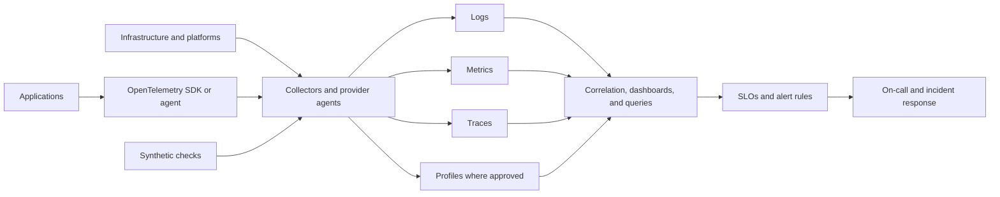

# Logging, Monitoring, and Observability Standard

## Purpose

This standard defines the telemetry and operational visibility required for cloud platforms and workloads. It covers logs, metrics, traces, events, audit records, synthetic checks, and profiles where mature and justified.

Monitoring answers known questions through predefined signals. Observability enables investigation of previously unknown failure modes by correlating rich telemetry across a system. Both are required; collecting large volumes of data without operational questions, ownership, and response paths is not compliant.

## Normative language

The key words **MUST**, **MUST NOT**, **REQUIRED**, **SHOULD**, **SHOULD NOT**, and **MAY** are normative:

- **MUST / MUST NOT**: mandatory for in-scope platforms and workloads.
- **SHOULD / SHOULD NOT**: expected unless a documented risk-based exception is approved.
- **MAY**: optional and selected according to workload requirements.

Where a cloud-provider feature cannot implement a requirement directly, the implementation MUST provide an equivalent control and record the equivalence in the architecture decision record (ADR).

## Observability principles

1. **Start from service objectives.** Telemetry and alerts MUST support reliability, security, performance, and business outcomes.
2. **Use common semantics.** Resource, service, environment, version, region, and correlation identifiers MUST be consistent.
3. **Alert on symptoms and actionable causes.** Alerts MUST have owners and response actions.
4. **Centralize without creating a single blind spot.** Telemetry pipelines MUST be resilient and monitored.
5. **Protect telemetry.** Logs can contain sensitive data and MUST follow classification, retention, and access controls.
6. **Prefer open instrumentation.** OpenTelemetry or another portable semantic model SHOULD be used for application telemetry.

## Mandatory requirements

| Requirement | Control statement | Minimum evidence |
|---|---|---|
| `SBP-10-REQ-001` | Every production service MUST define service-level indicators and objectives appropriate to user-visible outcomes. | SLO document and dashboard |
| `SBP-10-REQ-002` | Applications MUST emit structured logs with timestamp, severity, service, environment, version, and correlation identifiers. | Log schema sample |
| `SBP-10-REQ-003` | Distributed services SHOULD propagate trace context across synchronous and asynchronous boundaries. | Trace query and instrumentation test |
| `SBP-10-REQ-004` | Infrastructure and managed-service platform metrics and logs MUST be enabled according to a documented telemetry profile. | Diagnostic configuration |
| `SBP-10-REQ-005` | Cloud control-plane and identity audit logs MUST be centralized and protected. | Log routing and retention |
| `SBP-10-REQ-006` | Telemetry MUST use synchronized time and a consistent time zone representation, preferably UTC. | Host/service configuration |
| `SBP-10-REQ-007` | Logs MUST NOT contain secrets, access tokens, private keys, or unnecessary personal data. | Data-loss and log-content scan |
| `SBP-10-REQ-008` | Telemetry access MUST follow least privilege and sensitive audit/security logs MUST have restricted administration. | Access policy |
| `SBP-10-REQ-009` | Alert rules MUST include owner, severity, runbook, evaluation window, suppression behavior, and escalation route. | Alert catalog |
| `SBP-10-REQ-010` | Alerts MUST be tested before production use and reviewed for noise, missed detection, and stale ownership. | Alert test and review record |
| `SBP-10-REQ-011` | High-cardinality dimensions MUST be controlled to prevent cost and performance failure. | Telemetry schema and cost report |
| `SBP-10-REQ-012` | Telemetry pipelines MUST monitor ingestion delay, drop rate, queue depth, exporter failure, and storage health. | Pipeline health dashboard |
| `SBP-10-REQ-013` | Retention MUST be defined by telemetry type, operational need, security investigation, legal obligation, and cost. | Retention policy |
| `SBP-10-REQ-014` | Dashboards MUST identify data source, query, owner, intended audience, and freshness. | Dashboard metadata |
| `SBP-10-REQ-015` | Synthetic monitoring SHOULD validate critical user journeys and dependencies from relevant network locations. | Synthetic test results |
| `SBP-10-REQ-016` | Post-incident reviews MUST identify telemetry gaps and track remediation. | Incident action items |

## Reference observability pipeline



## Detailed implementation standard

### Telemetry taxonomy

The minimum signal set for a production service is:

- request, error, latency, and saturation metrics;
- application and platform logs;
- dependency health;
- deployment and configuration change events;
- identity and control-plane audit logs;
- traces for distributed request paths where technically feasible; and
- business or service outcome metrics needed to interpret user impact.

Continuous profiling MAY be used after privacy, overhead, and supportability review.

### Logging schema

Structured logs SHOULD use a machine-readable format. Common fields SHOULD include:

```text
timestamp, severity, service.name, service.version, deployment.environment,
cloud.provider, cloud.region, trace_id, span_id, request_id, operation,
outcome, error.type, duration_ms, resource_id
```

Free-form message text MAY supplement structured fields but MUST NOT be the only source for severity, service identity, or correlation.

### SLOs and error budgets

SLOs MUST be measurable from reliable telemetry and MUST specify the calculation window, population, exclusions, and data source. Error budgets SHOULD guide release risk and reliability investment. A target without an owner or decision process is not an operational SLO.

### Alert design

Paging alerts SHOULD represent imminent or actual user impact, security impact, or exhaustion of a critical safety margin. Ticket alerts MAY represent slower degradation or compliance work. Email-only alerts without an accountable queue are insufficient for critical conditions.

Alerts MUST account for missing data and telemetry-pipeline failure. Duplicate alerts from each instance SHOULD be aggregated to service impact where possible.

### Telemetry cost and retention

Teams MUST control verbose logs, duplicate ingestion, cardinality, sampling, retention, archive tiers, and cross-region export. Cost reduction MUST not remove telemetry needed for security, recovery, or validated SLOs. Sampling decisions MUST preserve error and high-latency traces according to policy.

### Operational readiness

Before production launch, teams MUST demonstrate dashboards, alert tests, on-call routing, runbooks, dependency monitoring, and telemetry failure detection. Ownership metadata MUST be synchronized with the service catalog.

## Multi-cloud implementation mapping

| Capability | Azure | AWS | GCP | OCI |
|---|---|---|---|---|
| Metrics and logs | Azure Monitor, Log Analytics | CloudWatch | Cloud Monitoring and Cloud Logging | Monitoring and Logging |
| Tracing/APM | Application Insights | X-Ray / Application Signals | Cloud Trace / Application Performance Management | Application Performance Monitoring |
| Audit logs | Azure Activity Log and Entra audit/sign-in logs | CloudTrail and service audit logs | Cloud Audit Logs | Audit |
| Managed collectors | Azure Monitor Agent / OTel distro | CloudWatch Agent / ADOT | Ops Agent / Google-built OTel Collector | Management Agent / OTel-compatible collectors |
| Synthetic monitoring | Application Insights availability tests | CloudWatch Synthetics | Cloud Monitoring uptime checks | APM synthetic monitoring or approved service |

Provider products are implementation examples, not exemptions from the normative requirements. Equivalent services MAY be used when they satisfy the same control objective.

## Validation

| Measure | Target or interpretation |
|---|---|
| SLO coverage | Production services with approved SLIs/SLOs and current dashboards. |
| Actionable paging rate | Percentage of pages requiring human action; low values indicate alert noise. |
| Telemetry ingestion delay | End-to-end time from event to query/alert availability. |
| Dropped telemetry | Collector, exporter, quota, and parsing losses. |
| Unknown-owner alerts | Alerts without a current response owner; target zero. |

## Adoption checklist

- [ ] Define SLIs, SLOs, and decision use.
- [ ] Instrument logs, metrics, traces, and audit events.
- [ ] Adopt common resource and correlation fields.
- [ ] Prevent secrets and unnecessary PII in telemetry.
- [ ] Centralize and protect control-plane and security logs.
- [ ] Create owned, tested, actionable alert rules.
- [ ] Monitor the telemetry pipeline itself.
- [ ] Set retention, sampling, and cardinality controls.
- [ ] Run operational-readiness and synthetic tests.

## Assurance evidence

Evidence MUST be reproducible and retained according to the enterprise records schedule. Acceptable evidence includes:

- version-controlled configuration and policy;
- pipeline logs and approval records;
- policy evaluation results;
- configuration snapshots or inventory exports;
- test and recovery reports;
- dashboards with query definitions; and
- approved ADRs and exception records.

Screenshots alone SHOULD NOT be treated as primary evidence when machine-readable evidence is available.

## Governance, exceptions, and enforcement

The Cloud Center of Excellence owns this standard. Platform engineering, security, reliability, application, data, and FinOps teams are accountable for implementing controls within their scope.

Exceptions MUST:

1. identify the unmet requirement ID;
2. describe business justification and quantified risk;
3. define compensating controls;
4. name an accountable owner;
5. include an expiry date not exceeding 180 days; and
6. be approved by the control owner and the relevant risk authority.

Expired exceptions are non-compliant. Automated policy checks SHOULD block new non-compliant deployments. Existing non-compliance MUST be tracked through a remediation backlog with owners and due dates.

## Review cycle

This document MUST be reviewed at least annually and after a material change to cloud-provider capabilities, regulatory obligations, enterprise risk tolerance, or the operating model. Changes MUST preserve requirement identifiers where the underlying control intent remains unchanged.

## Related topics

- [Backup, Recovery, and Resilience Standard](backup-recovery-and-resilience-standard.md)
- [CI/CD Pipeline and Release-Control Standard](ci-cd-pipeline-and-release-control-standard.md)
- [Cloud Security and Zero-Trust Standard](cloud-security-and-zero-trust-standard.md)

## References

- [OpenTelemetry documentation](https://opentelemetry.io/docs/)
- [OpenTelemetry signals](https://opentelemetry.io/docs/concepts/signals/)
- [Google SRE Workbook: Implementing SLOs](https://sre.google/workbook/implementing-slos/)
- [NIST SP 800-92: Guide to Computer Security Log Management](https://csrc.nist.gov/pubs/sp/800/92/final)
- [Microsoft Azure Well-Architected Framework](https://learn.microsoft.com/azure/well-architected/)
- [AWS Well-Architected Framework](https://docs.aws.amazon.com/wellarchitected/latest/framework/welcome.html)
- [GCP Well-Architected Framework](https://cloud.google.com/architecture/framework)
- [OCI Cloud Adoption Framework](https://docs.oracle.com/en-us/iaas/Content/cloud-adoption-framework/home.htm)
