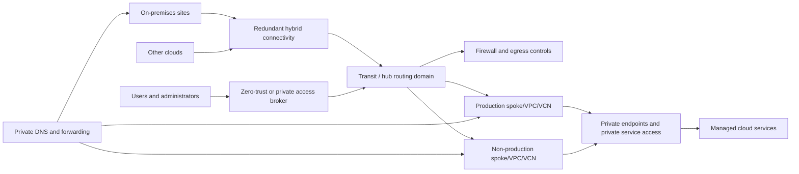

# 网络和私有连接标准

## 目的

该标准定义了连接云工作负载、托管服务、用户、站点和其他云所需的网络架构和控制。目标设计有利于私有服务访问、显式入口和出口、可改善控制的集中式策略以及可提高规模和弹性的分布式执行。

## 规范语言

关键字 **MUST**、**MUST NOT**、**REQUIRED**、**SHOULD**、**SHOULD NOT** 和 **MAY** 是规范性的：

- **MUST / MUST NOT**：对于范围内的平台和工作负载是强制性的。
- **SHOULD / SHOULD NOT**：预期，除非基于风险的例外情况得到批准。
- **MAY**：可选，根据工作负载需求选择。

当云提供商功能无法直接实现需求时，实现 MUST 提供等效控制并在架构决策记录（ADR）中记录等效性。

## 网络原则

1. **默认情况下是私有的。** 托管服务和管理路径 SHOULD 使用私有端点或私有服务访问。
2. **子网没有隐式信任。** 网络位置是一个信号，而不是授权决策。
3. **显式路由和出口。** 互联网和跨境流量 MUST 遵循记录在案的、可监控的路径。
4. **DNS 是架构。** 如果没有确定性名称解析，私有连接是不完整的。
5. **按风险和生命周期细分。** 生产、非生产、管理、共享服务和敏感工作负载 MUST 具有受控边界。
6. **针对故障进行设计。** 连接、DNS、防火墙、网关和电路 MUST 符合可用性和恢复要求。

## 强制性要求

|要求 |控制语句|最低限度的证据|
|---|---|---|
| `SBP-07-REQ-001` |云网络 MUST 使用经过批准的 IP 地址管理计划，MUST 避免连接环境中的地址空间重叠。 | IPAM 分配和重叠扫描|
| `SBP-07-REQ-002` |生产、非生产、管理和共享服务网络 MUST 根据风险和运营所有权进行分段。 |网络架构及有效路由|
| `SBP-07-REQ-003` |管理访问 SHOULD 使用私有、代理或零信任访问路径，而不是公共管理端点。 |访问架构|
| `SBP-07-REQ-004` |托管平台服务 SHOULD 使用私有端点、PrivateLink、Private Service Connect、服务网关或受支持且合理的等效私有访问。 |端点清单|
| `SBP-07-REQ-005` |Private DNS 区域和转发规则 MUST 与私有端点和混合连接共同设计，而不是事后添加。 | DNS 架构和解析测试 |
| `SBP-07-REQ-006` |入口 MUST 通过经过批准的负载均衡、API 网关、入口或具有 TLS 和应用 WAF 保护的反向代理控制来终止。 | Ingress 清单和配置 |
| `SBP-07-REQ-007` |互联网出站 MUST 明确记录，并在可行的情况下按目的地、服务、身份或代理策略进行限制。 |出口策略和流日志 |
| `SBP-07-REQ-008` |默认路由、传递路由、路由传播和非对称路由风险 MUST 记录并测试。 |路由表和测试证据|
| `SBP-07-REQ-009` |网络安全规则 MUST 使用最低权限，MUST NOT 包含来自互联网的不受限制的管理端口。 |规则扫描 |
| `SBP-07-REQ-010` |混合和云间连接 MUST 在服务目标需要时使用冗余路径，并且 MUST 监控隧道/电路运行状况。 |冗余设计和监控|
| `SBP-07-REQ-011` |传输中加密 MUST 可在不可信或共享网络中使用；仅私有寻址并不能消除加密要求。 | TLS/IPsec 配置 |
| `SBP-07-REQ-012` |网络流量、防火墙、DNS、负载均衡器和网关日志 MUST 根据风险启用并集中保留。 |日志配置|
| `SBP-07-REQ-013` |网络变更 MUST 通过代码交付、审查、测试，并包括回滚或旁路计划。 | IaC 变更记录|
| `SBP-07-REQ-014` |网络设备和集中式防火墙 MUST NOT 成为彻底的单点故障或吞吐量瓶颈。 |容量和故障模式分析|
| `SBP-07-REQ-015` |跨环境连接 MUST 默认被拒绝，并通过记录在案的用例获取批准。 |有效的策略和批准|

## 参考私有连接架构

## 详细执行标准

### 寻址和层次结构

IP 范围 MUST 由权威 IPAM 系统分配。分配前 SHOULD 考虑收购、合作伙伴网络和未来区域增长。NAT 可以暂时缓解地址重叠，但 MUST NOT 成为企业连接的默认长期架构。

网络层次结构 SHOULD 与云资源层次结构和所有权保持一致。共享中转 SHOULD 与工作负载部署权限分离。

### 私有服务访问和 DNS

私有端点会更改数据包路由和名称解析。设计 MUST 定义：

- Private DNS 区域或同等提供商；
- 权威所有权；
- 与消费网络的链接或关联；
- 混合转发路径；
- 水平分割行为；
- 解析器可用性；和
- 来自每个支持的源网络的验证。

禁止对托管服务进行硬编码专用 IP 地址。应用 MUST 使用支持的服务名称。

### 入口

互联网入口 MUST 使用经批准的边缘服务。计算资源 SHOULD 禁止直接使用公共 IP。TLS 策略、证书所有权、支持的协议、运行状况探测、源地址保留、WAF 规则和拒绝服务控制 MUST 记录在案。

内部入口 SHOULD 在适当的情况下使用专用负载均衡器或服务网格/集群入口。东西向授权 MUST 不单纯依赖源 IP。

### 出口

出口架构 MUST 区分操作系统更新、提供商 API、软件包仓库、SaaS 依赖项、合作伙伴端点和无限制浏览。目标白名单 SHOULD 使用服务标签、托管前缀列表、FQDN 策略或私有端点，而不是在支持时使用脆弱的手动维护的 IP 列表。

如果使用 TLS 检查，该检查 MUST 与提供商端点、证书验证、相互 TLS 和固定应用兼容。绕过操作 MUST 记录并监控。

### 弹性和能力

网关、防火墙、DNS 解析器、NAT 服务和电路 MUST 大小可根据吞吐量、连接计数、每秒数据包、路由规模和故障条件进行调整。容量测试 SHOULD 包括故障转移，因为剩余实例可能会收到满负载。

## 多云实施映射

|能力|Azure|AWS | GCP |OCI |
|---|---|---|---|---|
|网络构建|互联网络|专有网络|专有网络|维网|
|交通 |Virtual WAN 或中心 VNet |Transit Gateway/Cloud WAN |Network Connectivity Center| DRG |
|私有托管服务访问|私有端点/私有链接|接口/网关 VPC 端点/PrivateLink | Private Service Connect / 私有服务访问 |私有端点/服务网关|
|域名解析 | Azure DNS Private Resolver/Private DNS | Route 53 Resolver/private hosted zones |Cloud DNS / forwarding zones | DNS private views/resolver endpoints |
|混合连接 | ExpressRoute / VPN 网关 |Direct Connect/站点到站点 VPN |Cloud Interconnect/Cloud VPN | FastConnect / 站点到站点 VPN |
提供商产品是实施示例，而不是规范要求的豁免。当满足相同的控制目标时，MAY 使用等效服务。

## 验证

|测量 |目标或解释 |
|---|---|
|公共 IP 数量|计算和管理资源上的直接公共地址；除非获取批准，否则目标为零。 |
|私有服务覆盖 |使用私有访问的合格生产托管服务。 |
|不受限制的规则数量 |允许广泛来源/目的地或管理端口的规则。 |
| DNS 解析成功 |跨受支持的源网络的综合测试。 |
|连接故障转移目标|电路、网关、防火墙或解析器故障的测量恢复时间。 |

## 采用清单

- [ ] 通过 IPAM 分配地址空间。
- [ ] 分段环境和管理平面。
- [ ] 定义中转、路由传播和故障域。
- [ ] 使用私有端点并一起设计 Private DNS。
- [ ] 集中批准的入口和显式出口。
- [ ] 禁止直接公共管理访问。
- [ ] 启用网络、防火墙、DNS 和负载均衡器遥测。
- [ ] 测试混合冗余、容量和故障转移。
- [ ] 通过经过审核的 IaC 交付网络变更。

## 保障性证据

证据 MUST 可根据企业日志保留计划进行复制和保留。可接受的证据包括：

- 版本控制的配置和策略；
- 流水线日志和批准记录；
- 策略评估结果；
- 配置快照或清单导出；
- 测试和恢复报告；
- 带有查询定义的仪表板；和
- 批准的 ADR 和例外日志记录。

当机器可读证据可用时，仅 SHOULD NOT 屏幕截图可被视为主要证据。

## 治理、例外和执行

云卓越中心负责该标准。平台工程、安全性、可靠性、应用、数据和 FinOps 团队负责在其范围内实施控制。

例外情况 MUST 满足以下条件：

1. 识别未满足的需求 ID；
2. 描述业务合理性和量化风险；
3. 定义补偿性控制；
4. 指定一名负责任的所有者；
5. 包含不超过180天的有效期；和
6. 经控制所有者和相关风险主管部门批准。

过期的例外是不合规的。自动策略检查 SHOULD 阻止新的不合规部署。现有不合规项 MUST 通过修复积压、负责人和截止日期进行跟踪。

## 审核周期

本文件 MUST 至少每年审查一次，并且在云提供商能力、监管义务、企业风险承受能力或运营模式发生重大变化之后进行审查。更改 MUST 保留需求标识符，而底层控制意图保持不变。

## 相关主题

- [云安全和零信任标准](cloud-security-and-zero-trust-standard.md)
- [备份、恢复和弹性标准](backup-recovery-and-resilience-standard.md)
- [CI/CD 流水线与发布控制标准](ci-cd-pipeline-and-release-control-standard.md)

## 参考文档
- [NIST SP 800-207：零信任架构](https://csrc.nist.gov/pubs/sp/800/207/final)
- [Azure Private Link 文档](https://learn.microsoft.com/azure/private-link/)
- [AWS PrivateLink 文档](https://docs.aws.amazon.com/vpc/latest/privatelink/what-is-privatelink.html)
- [GCP Private Service Connect](https://cloud.google.com/vpc/docs/private-service-connect)
- [OCI Object Storage 私有端点](https://docs.oracle.com/en-us/iaas/Content/Object/Tasks/private-endpoints.htm)
- [Microsoft Azure Well-Architected Framework](https://learn.microsoft.com/azure/well-architected/)
- [AWS Well-Architected Framework](https://docs.aws.amazon.com/wellarchitected/latest/framework/welcome.html)
- [GCP Well-Architected Framework](https://cloud.google.com/architecture/framework)
- [OCI Cloud Adoption Framework](https://docs.oracle.com/en-us/iaas/Content/cloud-adoption-framework/home.htm)
