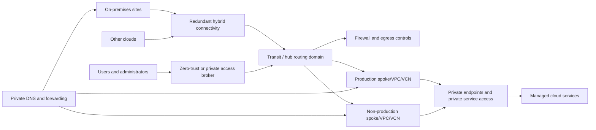

# Network and Private-Connectivity Standard

## Purpose

This standard defines the network architecture and controls required to connect cloud workloads, managed services, users, sites, and other clouds. The target design favors private service access, explicit ingress and egress, centralized policy where it improves control, and distributed enforcement where it improves scale and resilience.

## Normative language

The key words **MUST**, **MUST NOT**, **REQUIRED**, **SHOULD**, **SHOULD NOT**, and **MAY** are normative:

- **MUST / MUST NOT**: mandatory for in-scope platforms and workloads.
- **SHOULD / SHOULD NOT**: expected unless a documented risk-based exception is approved.
- **MAY**: optional and selected according to workload requirements.

Where a cloud-provider feature cannot implement a requirement directly, the implementation MUST provide an equivalent control and record the equivalence in the architecture decision record (ADR).

## Network principles

1. **Private by default.** Managed services and administrative paths SHOULD use private endpoints or private service access.
2. **No implicit trust by subnet.** Network location is one signal, not the authorization decision.
3. **Explicit routing and egress.** Internet and cross-boundary traffic MUST follow documented, observable paths.
4. **DNS is architecture.** Private connectivity is incomplete without deterministic name resolution.
5. **Segment by risk and lifecycle.** Production, non-production, management, shared services, and sensitive workloads MUST have controlled boundaries.
6. **Design for failure.** Connectivity, DNS, firewalls, gateways, and circuits MUST match availability and recovery requirements.

## Mandatory requirements

| Requirement | Control statement | Minimum evidence |
|---|---|---|
| `SBP-07-REQ-001` | Cloud networks MUST use an approved IP address management plan and MUST avoid overlapping address space across connected environments. | IPAM allocation and overlap scan |
| `SBP-07-REQ-002` | Production, non-production, management, and shared-services networks MUST be segmented according to risk and operational ownership. | Network architecture and effective routes |
| `SBP-07-REQ-003` | Administrative access SHOULD use private, brokered, or zero-trust access paths rather than public management endpoints. | Access architecture |
| `SBP-07-REQ-004` | Managed platform services SHOULD use private endpoints, PrivateLink, Private Service Connect, service gateways, or equivalent private access where supported and justified. | Endpoint inventory |
| `SBP-07-REQ-005` | Private DNS zones and forwarding rules MUST be designed with private endpoints and hybrid connectivity, not added as an afterthought. | DNS architecture and resolution tests |
| `SBP-07-REQ-006` | Ingress MUST terminate through approved load-balancing, API gateway, ingress, or reverse-proxy controls with TLS and applicable WAF protections. | Ingress inventory and configuration |
| `SBP-07-REQ-007` | Egress to the internet MUST be explicit, logged, and restricted by destination, service, identity, or proxy policy where feasible. | Egress policy and flow logs |
| `SBP-07-REQ-008` | Default routes, transitive routing, route propagation, and asymmetric-routing risks MUST be documented and tested. | Route tables and test evidence |
| `SBP-07-REQ-009` | Network security rules MUST use least privilege and MUST NOT contain unrestricted administrative ports from the internet. | Rule scan |
| `SBP-07-REQ-010` | Hybrid and inter-cloud connectivity MUST use redundant paths when required by the service objective and MUST monitor tunnel/circuit health. | Redundancy design and monitoring |
| `SBP-07-REQ-011` | Encryption in transit MUST be used across untrusted or shared networks; private addressing alone does not remove encryption requirements. | TLS/IPsec configuration |
| `SBP-07-REQ-012` | Network flow, firewall, DNS, load-balancer, and gateway logs MUST be enabled according to risk and retained centrally. | Logging configuration |
| `SBP-07-REQ-013` | Network changes MUST be delivered through code, reviewed, tested, and include a rollback or bypass plan. | IaC change record |
| `SBP-07-REQ-014` | Network appliances and centralized firewalls MUST not become unmitigated single points of failure or throughput bottlenecks. | Capacity and failure-mode analysis |
| `SBP-07-REQ-015` | Cross-environment connectivity MUST be denied by default and approved through documented use cases. | Effective policy and approval |

## Reference private-connectivity architecture

## Detailed implementation standard

### Addressing and hierarchy

IP ranges MUST be allocated from an authoritative IPAM system. Acquisitions, partner networks, and future region growth SHOULD be considered before assignment. NAT MAY mitigate overlap temporarily but MUST NOT be the default long-term architecture for enterprise connectivity.

Network hierarchy SHOULD align with cloud resource hierarchy and ownership. Shared transit SHOULD be separated from workload deployment permissions.

### Private service access and DNS

A private endpoint changes both packet routing and name resolution. The design MUST define:

- the private DNS zone or provider equivalent;
- authoritative ownership;
- links or associations to consuming networks;
- hybrid forwarding paths;
- split-horizon behavior;
- resolver availability; and
- validation from every supported source network.

Hard-coded private IP addresses for managed services are prohibited. Applications MUST use supported service names.

### Ingress

Internet ingress MUST use approved edge services. Direct public IPs on compute SHOULD be prohibited. TLS policy, certificate ownership, supported protocols, health probes, source preservation, WAF rules, and denial-of-service controls MUST be documented.

Internal ingress SHOULD use private load balancers or service-mesh/cluster ingress where appropriate. East-west authorization MUST not rely solely on source IP.

### Egress

Egress architecture MUST distinguish operating-system updates, provider APIs, package repositories, SaaS dependencies, partner endpoints, and unrestricted browsing. Destination allowlists SHOULD use service tags, managed prefix lists, FQDN policy, or private endpoints rather than fragile manually maintained IP lists when supported.

TLS inspection, if used, MUST be compatible with provider endpoints, certificate validation, mutual TLS, and pinned applications. Bypasses MUST be documented and monitored.

### Resilience and capacity

Gateways, firewalls, DNS resolvers, NAT services, and circuits MUST be sized for throughput, connection count, packets per second, route scale, and failure conditions. Capacity tests SHOULD include failover because remaining instances may receive the full load.

## Multi-cloud implementation mapping

| Capability | Azure | AWS | GCP | OCI |
|---|---|---|---|---|
| Network construct | VNet | VPC | VPC network | VCN |
| Transit | Virtual WAN or hub VNet | Transit Gateway / Cloud WAN | Network Connectivity Center | DRG |
| Private managed-service access | Private Endpoint / Private Link | Interface/Gateway VPC Endpoint / PrivateLink | Private Service Connect / private services access | Private endpoints / service gateway |
| DNS | Azure DNS Private Resolver / Private DNS | Route 53 Resolver / private hosted zones | Cloud DNS / forwarding zones | DNS private views / resolver endpoints |
| Hybrid connectivity | ExpressRoute / VPN Gateway | Direct Connect / Site-to-Site VPN | Cloud Interconnect / Cloud VPN | FastConnect / Site-to-Site VPN |

Provider products are implementation examples, not exemptions from the normative requirements. Equivalent services MAY be used when they satisfy the same control objective.

## Validation

| Measure | Target or interpretation |
|---|---|
| Public IP count | Direct public addresses on compute and management resources; target zero unless approved. |
| Private service coverage | Eligible production managed services using private access. |
| Unrestricted rule count | Rules allowing broad sources/destinations or administrative ports. |
| DNS resolution success | Synthetic tests across supported source networks. |
| Connectivity failover objective | Measured recovery time for circuit, gateway, firewall, or resolver failure. |

## Adoption checklist

- [ ] Allocate address space through IPAM.
- [ ] Segment environments and management planes.
- [ ] Define transit, route propagation, and failure domains.
- [ ] Use private endpoints and design private DNS together.
- [ ] Centralize approved ingress and explicit egress.
- [ ] Prohibit direct public management access.
- [ ] Enable network, firewall, DNS, and load-balancer telemetry.
- [ ] Test hybrid redundancy, capacity, and failover.
- [ ] Deliver network changes through reviewed IaC.

## Assurance evidence

Evidence MUST be reproducible and retained according to the enterprise records schedule. Acceptable evidence includes:

- version-controlled configuration and policy;
- pipeline logs and approval records;
- policy evaluation results;
- configuration snapshots or inventory exports;
- test and recovery reports;
- dashboards with query definitions; and
- approved ADRs and exception records.

Screenshots alone SHOULD NOT be treated as primary evidence when machine-readable evidence is available.

## Governance, exceptions, and enforcement

The Cloud Center of Excellence owns this standard. Platform engineering, security, reliability, application, data, and FinOps teams are accountable for implementing controls within their scope.

Exceptions MUST:

1. identify the unmet requirement ID;
2. describe business justification and quantified risk;
3. define compensating controls;
4. name an accountable owner;
5. include an expiry date not exceeding 180 days; and
6. be approved by the control owner and the relevant risk authority.

Expired exceptions are non-compliant. Automated policy checks SHOULD block new non-compliant deployments. Existing non-compliance MUST be tracked through a remediation backlog with owners and due dates.

## Review cycle

This document MUST be reviewed at least annually and after a material change to cloud-provider capabilities, regulatory obligations, enterprise risk tolerance, or the operating model. Changes MUST preserve requirement identifiers where the underlying control intent remains unchanged.

## Related topics

- [Cloud Security and Zero-Trust Standard](cloud-security-and-zero-trust-standard.md)
- [Backup, Recovery, and Resilience Standard](backup-recovery-and-resilience-standard.md)
- [CI/CD Pipeline and Release-Control Standard](ci-cd-pipeline-and-release-control-standard.md)

## References

- [NIST SP 800-207: Zero Trust Architecture](https://csrc.nist.gov/pubs/sp/800/207/final)
- [Azure Private Link documentation](https://learn.microsoft.com/azure/private-link/)
- [AWS PrivateLink documentation](https://docs.aws.amazon.com/vpc/latest/privatelink/what-is-privatelink.html)
- [GCP Private Service Connect](https://cloud.google.com/vpc/docs/private-service-connect)
- [OCI Object Storage private endpoints](https://docs.oracle.com/en-us/iaas/Content/Object/Tasks/private-endpoints.htm)
- [Microsoft Azure Well-Architected Framework](https://learn.microsoft.com/azure/well-architected/)
- [AWS Well-Architected Framework](https://docs.aws.amazon.com/wellarchitected/latest/framework/welcome.html)
- [GCP Well-Architected Framework](https://cloud.google.com/architecture/framework)
- [OCI Cloud Adoption Framework](https://docs.oracle.com/en-us/iaas/Content/cloud-adoption-framework/home.htm)
