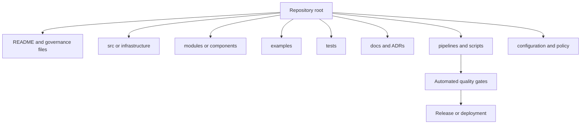

# 仓库结构和文档标准

## 目的

该标准定义了包含基础设施、平台配置、部署自动化、策略、操作工具或云架构资产的仓库所需的最低结构和文档。一致性减少了入驻时间、审查缺陷以及对单个贡献者的操作依赖。

## 规范语言

关键字 **MUST**、**MUST NOT**、**REQUIRED**、**SHOULD**、**SHOULD NOT** 和 **MAY** 是规范性的：

- **MUST / MUST NOT**：对于范围内的平台和工作负载是强制性的。
- **SHOULD / SHOULD NOT**：预期，除非基于风险的例外情况得到批准。
- **MAY**：可选，根据工作负载需求选择。

如果云提供商功能无法直接实现需求，则实现 MUST 提供等效控制并在架构决策记录（ADR）中记录等效性。

## 仓库原则

1. **仓库具有明确的产品边界。**其范围、所有者、使用者和生命周期 MUST 清晰。
2. **文档是更改的一部分。** 更改行为的代码 MUST 在同一审查中更新相关文档。
3. **操作所有权是可见的。** 响应者 MUST 能够在没有部落知识的情况下找到支持、部署、回滚和升级信息。
4. **生成的内容和创作的内容是有区别的。** 生成的文件 MUST 可复制并标记为生成。
5. **仓库访问遵循最低权限。** 管理权限和旁路权限 MUST 受到限制和审查。

## 强制性要求

|要求 |控制语句|最低限度的证据|
|---|---|---|
| `SBP-03-REQ-001` |每个仓库 MUST 包含一个自述文件，其中说明目的、范围、所有者、支持路径、先决条件、用法、部署方法和限制。 |自述文件审查 |
| `SBP-03-REQ-002` |每个仓库 MUST 通过 CODEOWNERS 或等效的审查路由机制声明所有权。 |所有权文件和分支规则 |
| `SBP-03-REQ-003` |默认分支 MUST 受到保护，并 MUST 求合并前的检查和审核成功。 |仓库设置导出|
| `SBP-03-REQ-004` |仓库 MUST 包括贡献指南、安全报告指南以及许可或内部使用条款。 |贡献、安全、许可证或策略文件 |
| `SBP-03-REQ-005` |基础设施仓库 MUST 记录环境布局、状态位置、身份模型和变更工作流程。 |架构/部署文档 |
| `SBP-03-REQ-006` | 重大架构决策 MUST 记录在版本控制的 ADR 中。 | ADR 目录和索引|
| `SBP-03-REQ-007` |面向用户或集成的更改 MUST 记录在更改日志或发布说明中。 |变更日志或发布 |
| `SBP-03-REQ-008` |在可行的情况下，文档链接和代码示例 MUST 自动进行测试。 |链接检查和示例测试结果 |
| `SBP-03-REQ-009` |机密、私钥、令牌、状态文件和生成的计划 MUST 从提交中排除并在合并之前进行扫描。 |忽略规则和机密扫描结果 |
| `SBP-03-REQ-010` |依赖项更新自动化 SHOULD 通过审查和兼容性测试启用。 |依赖更新配置|
| `SBP-03-REQ-011` |生成的文档 MUST 可从提交的源中复制，并且 MUST 识别生成命令。 |生成脚本和 CI 检查|
| `SBP-03-REQ-012` |存档仓库 MUST 为只读，MUST 标识替换或保留原因。 |存档通知和仓库设置|
| `SBP-03-REQ-013` |二进制制品 SHOULD 存储在制品仓库中，而不是提交到 Git，除非很小、经过审查且合理。 |仓库大小策略和制品参考 |
| `SBP-03-REQ-014` |仓库元数据 MUST 包括企业目录中的分类、关键性、生命周期状态和主要技术所有者。 |目录日志记录|

## 标准仓库模型

典型的布局是：
```text
.
├── README.md
├── CHANGELOG.md
├── CONTRIBUTING.md
├── SECURITY.md
├── CODEOWNERS
├── docs/
│   ├── architecture.md
│   ├── operations.md
│   └── adr/
├── src/ or infrastructure/
├── modules/ or components/
├── examples/
├── tests/
├── policies/
├── scripts/
└── .github/, .gitlab/, or pipelines/
```
## 详细执行标准

### 仓库边界选择

仓库 SHOULD 与可部署产品、可复用模块、策略包或明确归属的平台组件保持一致。当组件共享所有权、发布节奏、工具和访问要求时，MAY 使用 monorepo；当访问边界、生命周期、监管分类或部署权限不同时，SHOULD 使用多个仓库。

所选模型 MUST 记录在案。没有编目和所有权的仓库蔓延是不合规的；授予过多访问权限的 monorepo 也是不合规的。

### 自述文件最低内容

自述文件 MUST 说明：

- 这个仓库解决了什么问题？
- 什么是明确的范围内和范围外的内容？
- 谁负责并支持它？
- 先决条件和支持的版本是什么？
- 如何测试、部署、升级和回滚？
- 需要什么身份和机密？
- 架构、操作和事件文档在哪里？

### 架构和 ADR

架构文档 MUST 识别信任边界、依赖关系、数据流、部署单元、有状态组件、恢复假设和外部集成。 ADR MUST 记录背景、决定、替代方案、后果、日期和状态。被取代的 ADR MUST 仍然可用，并指出替换决定。

### 操作文档

生产仓库 MUST 包含或链接到用于部署、回滚、凭证故障、状态恢复、容量限制和常见事件的运行手册。 Runbook MUST 使用角色名称而不是个人名称，SHOULD 包含验证命令和预期结果。

### 文档质量控制

文档 MUST 避免使用未记录的首字母缩略词、陈旧的屏幕截图以及包含真实标识符或机密的复制粘贴命令。命令 SHOULD 默认情况下是安全的，MUST 明确标记破坏性操作。示例 MUST 使用不会被误认为生产值的占位符。

## 多云实施映射

|能力|Azure|AWS | GCP |OCI |
|---|---|---|---|---|
|仓库托管 | Azure Repos 或 GitHub Enterprise | CodeCommit 或 GitHub/GitLab |Cloud Source Repositories alternatives 或 GitHub/GitLab | OCI DevOps Code Repositories 或 GitHub/GitLab |
|制品存储 | Azure Artifacts/容器注册表 |CodeArtifact / ECR / S3 |Artifact Registry/Cloud Storage|制品/容器注册表/对象存储|
|目录链接 | Azure DevOps 扩展或企业目录 |服务目录/内部开发者门户|服务目录/内部开发者门户| OCI 目录集成/内部开发人员门户 |
|机密扫描| GitHub 高级安全性或批准的扫描仪 | CodeGuru 安全/认可的扫描仪 |Security Command Center 集成/批准的扫描仪 | Cloud Guard 集成/认可的扫描仪 |
|文档发布| GitHub Pages、Azure Static Web Apps | Amplify 托管或 S3/CloudFront | Firebase Hosting 或 Cloud Storage |Object Storage static site / OCI DevOps |
提供商产品是实施示例，而不是规范要求的豁免。当满足相同的控制目标时，MAY 使用等效服务。

## 验证

|测量 |目标或解释 |
|---|---|
|所有权完整性|具有当前所有者和支持路径的仓库；目标100%。 |
|文档新鲜度 |其关键文档随着上次重大行为更改而更改的仓库。 |
|断链率|内部和外部文档链接失败。 |
|孤儿仓库计数 |没有有效所有者或目录记录在案的仓库；目标为零。 |
|机密侦查|已确认的机密已提交给来源；目标为零。 |

## 采用清单

- [ ] 定义仓库产品边界和所有者。
- [ ] 创建自述文件、贡献、安全和代码所有者。
- [ ] 保护默认分支。
- [ ] 添加架构、操作和 ADR 文档。
- [ ] 添加变更日志或发布说明。
- [ ] 配置机密、依赖关系和链接扫描。
- [ ] 文档生成命令并避免手动编辑生成的文件。
- [ ] 在企业目录中注册元数据。

## 保障性证据

证据 MUST 可根据企业日志保留计划进行复制和保留。可接受的证据包括：

- 版本控制的配置和策略；
- 流水线日志和批准记录；
- 策略评估结果；
- 配置快照或清单导出；
- 测试和恢复报告；
- 带有查询定义的仪表板；和
- 批准的 ADR 和例外日志记录。

当机器可读证据可用时，仅 SHOULD NOT 屏幕截图可被视为主要证据。

## 治理、例外和执行

云卓越中心负责该标准。平台工程、安全性、可靠性、应用、数据和 FinOps 团队负责在其范围内实施控制。

例外情况 MUST 满足以下条件：

1. 识别未满足的需求 ID；
2. 描述业务合理性和量化风险；
3. 定义补偿性控制；
4. 指定一名负责任的所有者；
5. 包含不超过180天的有效期；和
6. 经控制所有者和相关风险主管部门批准。

过期的例外是不合规的。自动策略检查 SHOULD 阻止新的不合规部署。现有不合规项 MUST 通过修复积压、负责人和截止日期进行跟踪。

## 审核周期

本文件 MUST 至少每年审查一次，并且在云提供商能力、监管义务、企业风险承受能力或运营模式发生重大变化后进行审查。更改 MUST 保留需求标识符，而底层控制意图保持不变。

## 相关主题

- [云安全和零信任标准](cloud-security-and-zero-trust-standard.md)
- [资源命名和标签标准](resource-naming-and-tagging-standard.md)
- [备份、恢复和弹性标准](backup-recovery-and-resilience-standard.md)

## 参考文档

- [GitHub 文档：关于代码所有者](https://docs.github.com/repositories/managing-your-repositorys-settings-and-features/customizing-your-repository/about-code-owners)
- [GitHub 文档：关于受保护分支](https://docs.github.com/repositories/configuring-branches-and-merges-in-your-repository/managing-protected-branches/about-protected-branches)
- [保留变更日志](https://keepachangelog.com/en/1.1.0/)
- [架构决策记录](https://adr.github.io/)
- [Microsoft Azure Well-Architected Framework](https://learn.microsoft.com/azure/well-architected/)
- [AWS Well-Architected Framework](https://docs.aws.amazon.com/wellarchitected/latest/framework/welcome.html)
- [GCP Well-Architected Framework](https://cloud.google.com/architecture/framework)
- [OCI Cloud Adoption Framework](https://docs.oracle.com/en-us/iaas/Content/cloud-adoption-framework/home.htm)
