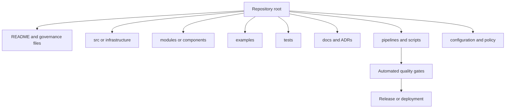

# Repository Structure and Documentation Standard

## Purpose

This standard defines the minimum structure and documentation required for repositories that contain infrastructure, platform configuration, deployment automation, policy, operational tooling, or cloud architecture assets. Consistency reduces onboarding time, review defects, and operational dependency on individual contributors.

## Normative language

The key words **MUST**, **MUST NOT**, **REQUIRED**, **SHOULD**, **SHOULD NOT**, and **MAY** are normative:

- **MUST / MUST NOT**: mandatory for in-scope platforms and workloads.
- **SHOULD / SHOULD NOT**: expected unless a documented risk-based exception is approved.
- **MAY**: optional and selected according to workload requirements.

Where a cloud-provider feature cannot implement a requirement directly, the implementation MUST provide an equivalent control and record the equivalence in the architecture decision record (ADR).

## Repository principles

1. **A repository has an explicit product boundary.** Its scope, owner, consumers, and lifecycle MUST be clear.
2. **Documentation is part of the change.** Code that changes behavior MUST update relevant documentation in the same review.
3. **Operational ownership is visible.** A responder MUST be able to find support, deployment, rollback, and escalation information without tribal knowledge.
4. **Generated and authored content are distinguished.** Generated files MUST be reproducible and marked as generated.
5. **Repository access follows least privilege.** Administrative permissions and bypass rights MUST be limited and reviewed.

## Mandatory requirements

| Requirement | Control statement | Minimum evidence |
|---|---|---|
| `SBP-03-REQ-001` | Every repository MUST contain a README that states purpose, scope, owner, support path, prerequisites, usage, deployment method, and limitations. | README review |
| `SBP-03-REQ-002` | Every repository MUST declare ownership through CODEOWNERS or an equivalent review-routing mechanism. | Ownership file and branch rule |
| `SBP-03-REQ-003` | The default branch MUST be protected and MUST require successful checks and review before merge. | Repository settings export |
| `SBP-03-REQ-004` | Repositories MUST include contribution guidance, security reporting guidance, and licensing or internal-use terms. | CONTRIBUTING, SECURITY, LICENSE or policy files |
| `SBP-03-REQ-005` | Infrastructure repositories MUST document environment layout, state location, identity model, and change workflow. | Architecture/deployment documentation |
| `SBP-03-REQ-006` | Material architectural decisions MUST be captured in version-controlled ADRs. | ADR directory and index |
| `SBP-03-REQ-007` | User-facing or integration changes MUST be recorded in a changelog or release notes. | CHANGELOG or releases |
| `SBP-03-REQ-008` | Documentation links and code examples MUST be tested automatically where practical. | Link-check and example-test results |
| `SBP-03-REQ-009` | Secrets, private keys, tokens, state files, and generated plans MUST be excluded from commits and scanned before merge. | Ignore rules and secret-scan results |
| `SBP-03-REQ-010` | Dependency update automation SHOULD be enabled with review and compatibility testing. | Dependency update configuration |
| `SBP-03-REQ-011` | Generated documentation MUST be reproducible from committed source and MUST identify the generation command. | Generation script and CI check |
| `SBP-03-REQ-012` | Archived repositories MUST be read-only and MUST identify the replacement or retention reason. | Archive notice and repository setting |
| `SBP-03-REQ-013` | Binary artifacts SHOULD be stored in an artifact repository rather than committed to Git unless small, reviewed, and justified. | Repository size policy and artifact references |
| `SBP-03-REQ-014` | Repository metadata MUST include classification, criticality, lifecycle state, and primary technical owner in the enterprise catalog. | Catalog record |

## Standard repository model



A typical layout is:

```text
.
├── README.md
├── CHANGELOG.md
├── CONTRIBUTING.md
├── SECURITY.md
├── CODEOWNERS
├── docs/
│   ├── architecture.md
│   ├── operations.md
│   └── adr/
├── src/ or infrastructure/
├── modules/ or components/
├── examples/
├── tests/
├── policies/
├── scripts/
└── .github/, .gitlab/, or pipelines/
```

## Detailed implementation standard

### Repository boundary selection

A repository SHOULD align to a deployable product, reusable module, policy bundle, or clearly owned platform component. A monorepo MAY be used when components share ownership, release cadence, tooling, and access requirements. Multiple repositories SHOULD be used when access boundaries, lifecycle, regulatory classification, or deployment authority differ.

The chosen model MUST be documented. Repository sprawl without cataloging and ownership is non-compliant; a monorepo that grants excessive access is also non-compliant.

### README minimum content

The README MUST answer:

- What problem does this repository solve?
- What is explicitly in and out of scope?
- Who owns and supports it?
- What are the prerequisites and supported versions?
- How is it tested, deployed, upgraded, and rolled back?
- What identities and secrets are required?
- Where are architecture, operations, and incident documents?

### Architecture and ADRs

Architecture documentation MUST identify trust boundaries, dependencies, data flows, deployment units, stateful components, recovery assumptions, and external integrations. ADRs MUST record context, decision, alternatives, consequences, date, and status. Superseded ADRs MUST remain available and point to the replacing decision.

### Operational documentation

Production repositories MUST include or link to runbooks for deployment, rollback, credential failure, state recovery, capacity constraints, and common incidents. Runbooks MUST use role names rather than personal names and SHOULD contain validation commands and expected results.

### Documentation quality controls

Documentation MUST avoid undocumented acronyms, stale screenshots, and copy-pasted commands containing real identifiers or secrets. Commands SHOULD be safe by default and MUST clearly label destructive operations. Examples MUST use placeholders that cannot be mistaken for production values.

## Multi-cloud implementation mapping

| Capability | Azure | AWS | GCP | OCI |
|---|---|---|---|---|
| Repository hosting | Azure Repos or GitHub Enterprise | CodeCommit or GitHub/GitLab | Cloud Source Repositories alternatives or GitHub/GitLab | OCI DevOps Code Repositories or GitHub/GitLab |
| Artifact storage | Azure Artifacts / Container Registry | CodeArtifact / ECR / S3 | Artifact Registry / Cloud Storage | Artifacts / Container Registry / Object Storage |
| Catalog linkage | Azure DevOps extensions or enterprise catalog | Service Catalog / internal developer portal | Service Catalog / internal developer portal | OCI catalog integrations / internal developer portal |
| Secret scanning | GitHub Advanced Security or approved scanner | CodeGuru Security/approved scanner | Security Command Center integrations/approved scanner | Cloud Guard integrations/approved scanner |
| Documentation publishing | GitHub Pages, Azure Static Web Apps | Amplify Hosting or S3/CloudFront | Firebase Hosting or Cloud Storage | Object Storage static website / OCI DevOps |

Provider products are implementation examples, not exemptions from the normative requirements. Equivalent services MAY be used when they satisfy the same control objective.

## Validation

| Measure | Target or interpretation |
|---|---|
| Ownership completeness | Repositories with a current owner and support path; target 100%. |
| Documentation freshness | Repositories whose key docs changed with the last material behavior change. |
| Broken-link rate | Failed internal and external documentation links. |
| Orphan repository count | Repositories without an active owner or catalog record; target zero. |
| Secret detection | Confirmed secrets committed to source; target zero. |

## Adoption checklist

- [ ] Define repository product boundary and owner.
- [ ] Create README, CONTRIBUTING, SECURITY, and CODEOWNERS.
- [ ] Protect the default branch.
- [ ] Add architecture, operations, and ADR documentation.
- [ ] Add changelog or release notes.
- [ ] Configure secret, dependency, and link scanning.
- [ ] Document generation commands and avoid hand-edited generated files.
- [ ] Register metadata in the enterprise catalog.

## Assurance evidence

Evidence MUST be reproducible and retained according to the enterprise records schedule. Acceptable evidence includes:

- version-controlled configuration and policy;
- pipeline logs and approval records;
- policy evaluation results;
- configuration snapshots or inventory exports;
- test and recovery reports;
- dashboards with query definitions; and
- approved ADRs and exception records.

Screenshots alone SHOULD NOT be treated as primary evidence when machine-readable evidence is available.

## Governance, exceptions, and enforcement

The Cloud Center of Excellence owns this standard. Platform engineering, security, reliability, application, data, and FinOps teams are accountable for implementing controls within their scope.

Exceptions MUST:

1. identify the unmet requirement ID;
2. describe business justification and quantified risk;
3. define compensating controls;
4. name an accountable owner;
5. include an expiry date not exceeding 180 days; and
6. be approved by the control owner and the relevant risk authority.

Expired exceptions are non-compliant. Automated policy checks SHOULD block new non-compliant deployments. Existing non-compliance MUST be tracked through a remediation backlog with owners and due dates.

## Review cycle

This document MUST be reviewed at least annually and after a material change to cloud-provider capabilities, regulatory obligations, enterprise risk tolerance, or the operating model. Changes MUST preserve requirement identifiers where the underlying control intent remains unchanged.

## Related topics

- [Cloud Security and Zero-Trust Standard](cloud-security-and-zero-trust-standard.md)
- [Resource Naming and Tagging Standard](resource-naming-and-tagging-standard.md)
- [Backup, Recovery, and Resilience Standard](backup-recovery-and-resilience-standard.md)

## References

- [GitHub documentation: About code owners](https://docs.github.com/repositories/managing-your-repositorys-settings-and-features/customizing-your-repository/about-code-owners)
- [GitHub documentation: About protected branches](https://docs.github.com/repositories/configuring-branches-and-merges-in-your-repository/managing-protected-branches/about-protected-branches)
- [Keep a Changelog](https://keepachangelog.com/en/1.1.0/)
- [Architecture Decision Records](https://adr.github.io/)
- [Microsoft Azure Well-Architected Framework](https://learn.microsoft.com/azure/well-architected/)
- [AWS Well-Architected Framework](https://docs.aws.amazon.com/wellarchitected/latest/framework/welcome.html)
- [GCP Well-Architected Framework](https://cloud.google.com/architecture/framework)
- [OCI Cloud Adoption Framework](https://docs.oracle.com/en-us/iaas/Content/cloud-adoption-framework/home.htm)
