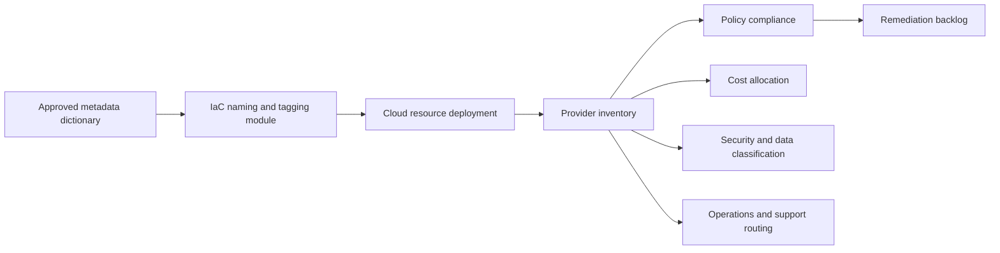

# 资源命名和标签标准

## 目的

该标准为 Azure、AWS、GCP 和 OCI 资源定义了一致的命名和元数据模型。名称支持人类识别和技术集成；标签或标签为所有权、成本分配、策略、安全、操作和生命周期管理提供权威的元数据。

名称不能替代标签。名称 SHOULD 保持简洁和稳定，而可变的业务元数据 MUST 存储在标签、标签或企业资源目录中。

## 规范语言

关键字 **MUST**、**MUST NOT**、**REQUIRED**、**SHOULD**、**SHOULD NOT** 和 **MAY** 是规范性的：

- **MUST / MUST NOT**：对于范围内的平台和工作负载是强制性的。
- **SHOULD / SHOULD NOT**：预期，除非基于风险的例外情况得到批准。
- **MAY**：可选，根据工作负载需求选择。

在云提供商功能无法直接实现需求的情况下，实现 MUST 提供等效控制并在架构决策记录（ADR）中记录等效性。

## 命名和元数据原则

1. **稳定的名称，可变的元数据。** 当名称预计会更改时，不要在名称中编码信息。
2. **提供商约束具有权威性。** 规范化模型 MUST 适合特定于服务的长度、字符、唯一性和不变性规则。
3. **无敏感数据。** 名称和标签 MUST NOT 包含机密、个人数据、客户名称或受监管的标识符，除非得到特别批准。
4. **元数据具有受控词汇。** 所需的键和枚举值 MUST 集中定义。
5. **所有权和成本是强制性的。** 每个可计费资源 MUST 归属于负责任的所有者和成本对象。

## 强制性要求

|要求 |控制语句|最低限度的证据|
|---|---|---|
| `SBP-04-REQ-001` |资源名称 MUST 遵循企业模式，除非提供商生成的名称或不可变的外部要求应用。 |策略结果及盘点样本|
| `SBP-04-REQ-002` |名称 MUST 仅使用在目标提供商/服务中有效的字符，而 SHOULD 在支持的情况下使用带有连字符的小写字母。 |命名函数和测试|
| `SBP-04-REQ-003` |名称 MUST NOT 包含机密、电子邮件地址、个人姓名、客户数据或受监管的标识符。 |策略扫描|
| `SBP-04-REQ-004` |全局唯一名称 MUST 使用确定性唯一性后缀，而不是随机的手动变体。 |命名算法|
| `SBP-04-REQ-005` |环境代码 MUST 使用认可的词汇，例如 `dev`、`test`、`stage` 和 `prod`。 |元数据字典 |
| `SBP-04-REQ-006` |每个计费资源 MUST 包括 `owner`、`cost_center`、`application`、`environment` 和 `managed_by` 元数据（其中提供程序支持）。 |标签合规报告|
| `SBP-04-REQ-007` |生产资源 MUST 包括 `criticality`、`data_classification` 和 `support_tier` 元数据。 |标签合规报告|
| `SBP-04-REQ-008` | IaC 管理的资源 MUST 包括仓库或部署源参考。 |标签/标签值和仓库查找 |
| `SBP-04-REQ-009` |用于自动化的标签 MUST 使用受控值，而 MUST NOT 依赖于自由格式的大写或拼写。 |标签字典和验证策略 |
| `SBP-04-REQ-010` |提供程序标签继承 MUST NOT 在未经验证的情况下被假定；所需元数据 MUST 在有效资源范围内应用。 |策略测试|
| `SBP-04-REQ-011` |标签键和值 MUST 保持在提供商限制内；系统 MUST 定义特定于服务的限制阻止所有可选标签时的行为。 |提供商约束测试|
| `SBP-04-REQ-012` |资源删除或报废工作流程 MUST 更新企业清单和成本所有权日志记录。 |退役日志记录|
| `SBP-04-REQ-013` |标记策略 MUST 阻止或标记在没有所需元数据的情况下创建资源。 |预防性或侦探性策略|
| `SBP-04-REQ-014` |代表人员的标签值 SHOULD 使用稳定的团队标识符而不是个人名称。 |标签字典 |
| `SBP-04-REQ-015` |不可标记资源 MUST 例外情况通过继承的范围元数据或外部资源目录来表示。 |目录映射|

## 元数据流

## 标准命名模型

首选的逻辑模式是：
```text
<organization>-<application>-<component>-<environment>-<region>-<instance>
```
并非每个元素都属于每个提供商资源名称。实现 MUST 定义特定于服务的缩写和最大长度。省略层次结构中已经明确的元素或导致名称无效或不稳定的元素。

示例：
```text
acme-payments-api-prod-cac-01
acme-data-lake-dev-use1
acme-shared-dns-prod-global
```
缩写 MUST 予以集中公布。当存在批准的值时，团队 MUST NOT 发明新的缩写。

## 所需的元数据字典

|关键|目的|示例|规则|
|---|---|---|---|
| `owner` |负责任的技术团队 | `team-cloud-platform` |稳定的团队标识 |
| `cost_center` |财政拨款| `cc-10420` |批准的财务代码 |
| `application` |服务或产品| `payments-api` |企业目录 ID 首选|
| `environment` |生命周期阶段 | `prod` |受控词汇|
| `managed_by` |管理权限| `terraform` | `terraform`、`bicep`、`cloudformation`、`manual-exception` 等 |
| `repository` |真相来源| `platform/payments-infra` |仓库 slug，不是机密 URL |
| `criticality` |业务影响 | `high` |受控层 |
| `data_classification` |处理的最高数据类 | `confidential` |企业分类词汇|
| `support_tier` |运营支持模式| `24x7` |受控词汇|
| `lifecycle` |当前状态 | `active` | `planned`、`active`、`deprecated`、`retire` |

可选元数据 SHOULD 包括 `business_unit`、`product_owner`、`expiry_date`、`backup_policy`、`patch_group`、`compliance_scope` 和 `service_level`（如果相关）。

## 执行层次

1.可复用模块中的命名和标记功能。
2. 部署前的 CI 策略即代码。
3. 部署时的提供商组织策略。
4. 计划的清单扫描和修复。
5. 使用相同元数据字典的成本和安全报告。

自动继承 MAY 减少重复，但资源上的有效元数据 MUST 对其使用者可查询且可靠。

## 多云实施映射

|能力|Azure|AWS | GCP |OCI |
|---|---|---|---|---|
|元数据机制|资源、资源组、订阅标签 |资源/账户上的标签；标签策略 |标签和资源标签；组织策略|定义的和自由格式的标签；标签默认值 |
|层次结构|管理组、订阅、资源组|组织、OU、账户 |组织、文件夹、项目 |租户，隔间|
|策略执行| Azure Policy | AWS Organizations tag policies and Config |Organization Policy and custom constraints|Tag defaults、IAM policy、Cloud Guard |
|清单查询 | Azure Resource Graph | AWS Resource Explorer / Config / Tag Editor |Cloud Asset Inventory| OCI Search |
|成本分配|Cost Management exports and tags|Cost allocation tags and CUR | Cloud Billing export and labels |Cost Analysis and defined tags|

提供商产品是实施示例，而不是规范要求的豁免。满足相同控制目标时 MAY 使用等效服务。

## 验证

|测量 |目标或解释 |
|---|---|
|必需标签合规性 |具有有效所需元数据的范围内资源的百分比；目标100%。 |
|负责人支出未知 |没有可解析的所有者的云成本；目标为零。 |
|无效词汇率 |使用未经批准的键值的资源。 |
|命名策略失败 |部署被无效名称阻止；趋势表明模块或文档存在缺陷。 |
|资源退役管理|已弃用的资源及其所有者和删除日期。 |

## 采用清单

- [ ] 发布批准的名称组合部分和缩写。
- [ ] 实现特定于提供商的命名功能。
- [ ] 定义受控元数据词汇。
- [ ] 在 IaC 和策略中强制执行所需的标签。
- [ ] 将元数据映射到成本、安全和支持系统。
- [ ] 扫描名称/标签中的 PII 和机密。
- [ ] 报告未知所有者和未分配的支出。
- [ ] 将退役与清单更新集成。

## 保障性证据

证据 MUST 可根据企业日志保留计划进行复制和保留。可接受的证据包括：

- 版本控制的配置和策略；
- 流水线日志和批准记录；
- 策略评估结果；
- 配置快照或清单导出；
- 测试和恢复报告；
- 带有查询定义的仪表板；和
- 批准的 ADR 和例外日志记录。

当机器可读证据可用时，仅 SHOULD NOT 屏幕截图可被视为主要证据。

## 治理、例外和执行

云卓越中心负责该标准。平台工程、安全性、可靠性、应用、数据和 FinOps 团队负责在其范围内实施控制。

例外情况 MUST 满足以下条件：

1. 识别未满足的需求 ID；
2. 描述业务合理性和量化风险；
3. 定义补偿性控制；
4. 指定一名负责任的所有者；
5. 包含不超过180天的有效期；和
6. 经控制所有者和相关风险主管部门批准。

过期的例外是不合规的。自动策略检查 SHOULD 阻止新的不合规部署。现有不合规项 MUST 通过修复积压、负责人和截止日期进行跟踪。

## 审核周期

本文件 MUST 至少每年审查一次，并且在云提供商能力、监管义务、企业风险承受能力或运营模式发生重大变化后进行审查。更改 MUST 保留需求标识符，而底层控制意图保持不变。

## 相关主题

- [云安全和零信任标准](cloud-security-and-zero-trust-standard.md)
- [仓库结构和文档标准](repository-structure-and-documentation-standard.md)
- [备份、恢复和弹性标准](backup-recovery-and-resilience-standard.md)

## 参考文档

- [Microsoft Cloud Adoption Framework: Define naming conventions](https://learn.microsoft.com/azure/cloud-adoption-framework/ready/azure-best-practices/resource-naming)
- [AWS 标记最佳实践](https://docs.aws.amazon.com/tag-editor/latest/userguide/tagging.html)
- [GCP：创建和管理标签](https://cloud.google.com/resource-manager/docs/creating-managing-labels)
- [OCI 标签概述](https://docs.oracle.com/en-us/iaas/Content/Tagging/Concepts/taggingoverview.htm)
- [Microsoft Azure Well-Architected Framework](https://learn.microsoft.com/azure/well-architected/)
- [AWS Well-Architected Framework](https://docs.aws.amazon.com/wellarchitected/latest/framework/welcome.html)
- [GCP Well-Architected Framework](https://cloud.google.com/architecture/framework)
- [OCI Cloud Adoption Framework](https://docs.oracle.com/en-us/iaas/Content/cloud-adoption-framework/home.htm)
