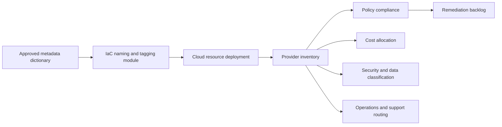

# Resource Naming and Tagging Standard

## Purpose

This standard defines a consistent naming and metadata model for Azure, AWS, GCP, and OCI resources. Names support human recognition and technical integration; tags or labels provide authoritative metadata for ownership, cost allocation, policy, security, operations, and lifecycle management.

Names are not a substitute for tags. Names SHOULD remain concise and stable, while changeable business metadata MUST be stored in tags, labels, or the enterprise resource catalog.

## Normative language

The key words **MUST**, **MUST NOT**, **REQUIRED**, **SHOULD**, **SHOULD NOT**, and **MAY** are normative:

- **MUST / MUST NOT**: mandatory for in-scope platforms and workloads.
- **SHOULD / SHOULD NOT**: expected unless a documented risk-based exception is approved.
- **MAY**: optional and selected according to workload requirements.

Where a cloud-provider feature cannot implement a requirement directly, the implementation MUST provide an equivalent control and record the equivalence in the architecture decision record (ADR).

## Naming and metadata principles

1. **Stable names, mutable metadata.** Do not encode information in a name when it is expected to change.
2. **Provider constraints are authoritative.** The normalized model MUST be adapted to service-specific length, character, uniqueness, and immutability rules.
3. **No sensitive data.** Names and tags MUST NOT contain secrets, personal data, customer names, or regulated identifiers unless specifically approved.
4. **Metadata has controlled vocabulary.** Required keys and enumerated values MUST be centrally defined.
5. **Ownership and cost are mandatory.** Every billable resource MUST be attributable to an accountable owner and cost object.

## Mandatory requirements

| Requirement | Control statement | Minimum evidence |
|---|---|---|
| `SBP-04-REQ-001` | Resource names MUST follow the enterprise pattern unless a provider-generated name or immutable external requirement applies. | Policy result and inventory sample |
| `SBP-04-REQ-002` | Names MUST use only characters valid across the target provider/service and SHOULD use lowercase with hyphens where supported. | Naming function and tests |
| `SBP-04-REQ-003` | Names MUST NOT contain secrets, email addresses, personal names, customer data, or regulated identifiers. | Policy scan |
| `SBP-04-REQ-004` | Globally unique names MUST use a deterministic uniqueness suffix rather than random manual variants. | Naming algorithm |
| `SBP-04-REQ-005` | Environment codes MUST use the approved vocabulary such as `dev`, `test`, `stage`, and `prod`. | Metadata dictionary |
| `SBP-04-REQ-006` | Every billable resource MUST include `owner`, `cost_center`, `application`, `environment`, and `managed_by` metadata where provider support exists. | Tag compliance report |
| `SBP-04-REQ-007` | Production resources MUST include `criticality`, `data_classification`, and `support_tier` metadata. | Tag compliance report |
| `SBP-04-REQ-008` | IaC-managed resources MUST include a repository or deployment-source reference. | Tag/label value and repository lookup |
| `SBP-04-REQ-009` | Tags used for automation MUST use controlled values and MUST NOT rely on free-form capitalization or spelling. | Tag dictionary and validation policy |
| `SBP-04-REQ-010` | Provider tag inheritance MUST NOT be assumed unless verified; required metadata MUST be applied at the effective resource scope. | Policy test |
| `SBP-04-REQ-011` | Tag keys and values MUST remain within provider limits; systems MUST define behavior when service-specific limits prevent all optional tags. | Provider constraint test |
| `SBP-04-REQ-012` | Resource deletion or retirement workflows MUST update the enterprise inventory and cost ownership records. | Decommission record |
| `SBP-04-REQ-013` | Tagging policies MUST prevent or flag creation of resources without required metadata. | Preventive or detective policy |
| `SBP-04-REQ-014` | Tag values representing people SHOULD use stable team identifiers rather than individual names. | Tag dictionary |
| `SBP-04-REQ-015` | Exceptions for untaggable resources MUST be represented through inherited scope metadata or the external resource catalog. | Catalog mapping |

## Metadata flow



## Standard naming model

The preferred logical pattern is:

```text
<organization>-<application>-<component>-<environment>-<region>-<instance>
```

Not every element belongs in every provider resource name. The implementation MUST define service-specific abbreviations and maximum lengths. Omit elements that are already unambiguous from hierarchy or that cause invalid or unstable names.

Examples:

```text
acme-payments-api-prod-cac-01
acme-data-lake-dev-use1
acme-shared-dns-prod-global
```

Abbreviations MUST be centrally published. Teams MUST NOT invent new abbreviations when an approved value exists.

## Required metadata dictionary

| Key | Purpose | Example | Rules |
|---|---|---|---|
| `owner` | Accountable technical team | `team-cloud-platform` | Stable team identifier |
| `cost_center` | Financial allocation | `cc-10420` | Approved finance code |
| `application` | Service or product | `payments-api` | Enterprise catalog ID preferred |
| `environment` | Lifecycle stage | `prod` | Controlled vocabulary |
| `managed_by` | Management authority | `terraform` | `terraform`, `bicep`, `cloudformation`, `manual-exception`, etc. |
| `repository` | Source of truth | `platform/payments-infra` | Repository slug, not a secret URL |
| `criticality` | Business impact | `high` | Controlled tier |
| `data_classification` | Highest data class handled | `confidential` | Enterprise classification vocabulary |
| `support_tier` | Operational support model | `24x7` | Controlled vocabulary |
| `lifecycle` | Current state | `active` | `planned`, `active`, `deprecated`, `retire` |

Optional metadata SHOULD include `business_unit`, `product_owner`, `expiry_date`, `backup_policy`, `patch_group`, `compliance_scope`, and `service_level` when relevant.

## Enforcement hierarchy

1. Naming and tagging functions in reusable modules.
2. CI policy-as-code before deployment.
3. Provider organization policy at deployment time.
4. Scheduled inventory scans and remediation.
5. Cost and security reports using the same metadata dictionary.

Automatic inheritance MAY reduce duplication, but the effective metadata on a resource MUST be queryable and reliable for its consumers.

## Multi-cloud implementation mapping

| Capability | Azure | AWS | GCP | OCI |
|---|---|---|---|---|
| Metadata mechanism | Tags on resources, resource groups, subscriptions | Tags on resources/accounts; tag policies | Labels and resource tags; organization policies | Defined and free-form tags; tag defaults |
| Hierarchy | Management group, subscription, resource group | Organization, OU, account | Organization, folder, project | Tenancy, compartment |
| Policy enforcement | Azure Policy | AWS Organizations tag policies and Config | Organization Policy and custom constraints | Tag defaults, IAM policy, Cloud Guard |
| Inventory query | Azure Resource Graph | AWS Resource Explorer / Config / Tag Editor | Cloud Asset Inventory | OCI Search |
| Cost allocation | Cost Management exports and tags | Cost allocation tags and CUR | Cloud Billing export and labels | Cost Analysis and defined tags |

Provider products are implementation examples, not exemptions from the normative requirements. Equivalent services MAY be used when they satisfy the same control objective.

## Validation

| Measure | Target or interpretation |
|---|---|
| Required-tag compliance | Percentage of in-scope resources with valid required metadata; target 100%. |
| Unknown owner spend | Cloud cost without a resolvable owner; target zero. |
| Invalid vocabulary rate | Resources using unapproved key values. |
| Naming-policy failures | Deployments blocked by invalid names; trend indicates module or documentation defects. |
| Retirement hygiene | Deprecated resources with an owner and removal date. |

## Adoption checklist

- [ ] Publish approved name components and abbreviations.
- [ ] Implement provider-specific naming functions.
- [ ] Define controlled metadata vocabulary.
- [ ] Enforce required tags in IaC and policy.
- [ ] Map metadata into cost, security, and support systems.
- [ ] Scan for PII and secrets in names/tags.
- [ ] Report unknown owners and unallocated spend.
- [ ] Integrate decommissioning with inventory updates.

## Assurance evidence

Evidence MUST be reproducible and retained according to the enterprise records schedule. Acceptable evidence includes:

- version-controlled configuration and policy;
- pipeline logs and approval records;
- policy evaluation results;
- configuration snapshots or inventory exports;
- test and recovery reports;
- dashboards with query definitions; and
- approved ADRs and exception records.

Screenshots alone SHOULD NOT be treated as primary evidence when machine-readable evidence is available.

## Governance, exceptions, and enforcement

The Cloud Center of Excellence owns this standard. Platform engineering, security, reliability, application, data, and FinOps teams are accountable for implementing controls within their scope.

Exceptions MUST:

1. identify the unmet requirement ID;
2. describe business justification and quantified risk;
3. define compensating controls;
4. name an accountable owner;
5. include an expiry date not exceeding 180 days; and
6. be approved by the control owner and the relevant risk authority.

Expired exceptions are non-compliant. Automated policy checks SHOULD block new non-compliant deployments. Existing non-compliance MUST be tracked through a remediation backlog with owners and due dates.

## Review cycle

This document MUST be reviewed at least annually and after a material change to cloud-provider capabilities, regulatory obligations, enterprise risk tolerance, or the operating model. Changes MUST preserve requirement identifiers where the underlying control intent remains unchanged.

## Related topics

- [Cloud Security and Zero-Trust Standard](cloud-security-and-zero-trust-standard.md)
- [Repository Structure and Documentation Standard](repository-structure-and-documentation-standard.md)
- [Backup, Recovery, and Resilience Standard](backup-recovery-and-resilience-standard.md)

## References

- [Microsoft Cloud Adoption Framework: Define your naming convention](https://learn.microsoft.com/azure/cloud-adoption-framework/ready/azure-best-practices/resource-naming)
- [AWS Tagging Best Practices](https://docs.aws.amazon.com/tag-editor/latest/userguide/tagging.html)
- [GCP: Creating and managing labels](https://cloud.google.com/resource-manager/docs/creating-managing-labels)
- [OCI Tagging Overview](https://docs.oracle.com/en-us/iaas/Content/Tagging/Concepts/taggingoverview.htm)
- [Microsoft Azure Well-Architected Framework](https://learn.microsoft.com/azure/well-architected/)
- [AWS Well-Architected Framework](https://docs.aws.amazon.com/wellarchitected/latest/framework/welcome.html)
- [GCP Well-Architected Framework](https://cloud.google.com/architecture/framework)
- [OCI Cloud Adoption Framework](https://docs.oracle.com/en-us/iaas/Content/cloud-adoption-framework/home.htm)
