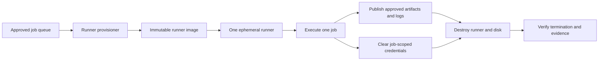

# 共享运行器安全与清理标准

## 目的

该标准定义了自托管和共享 CI/CD 运行器、构建代理、执行器和工作池的安全基线。共享运行器执行来自许多仓库的代码，是高价值的供应链目标。其默认架构 MUST 假设构建代码可能是恶意的或已遭入侵。

## 规范语言

关键字 **MUST**、**MUST NOT**、**REQUIRED**、**SHOULD**、**SHOULD NOT** 和 **MAY** 是规范性的：

- **MUST / MUST NOT**：对于范围内的平台和工作负载是强制性的。
- **SHOULD / SHOULD NOT**：预期，除非基于风险的例外情况得到批准。
- **MAY**：可选，根据工作负载需求选择。

当云提供商功能无法直接实现需求时，实现 MUST 提供等效控制并在架构决策记录（ADR）中记录等效性。

## 运行器安全原则

1. **默认情况下是短暂的。** 运行器 SHOULD 处理一项作业，然后被销毁或重新镜像。
2. **强大的租户隔离。** 信任级别、组织、仓库、环境和数据分类 MUST 在没有明确的风险决策的情况下不会共享执行能力。
3. **没有持久的机密。** 运行器 MUST 获取短暂的、工作范围内的凭证，并且 MUST 在执行后不会保留它们。
4. **受控出口。** 构建代码 MUST 无法不受限制地访问内部网络或敏感元数据端点。
5. **已知镜像和可重现的引导程序。** 运行器镜像、工具和配置 MUST 进行版本控制和完整性验证。
6. **可监控且一次性。** MUST 记录运行器创建、作业分配、身份使用、网络访问和销毁。

## 强制性要求

|要求 |控制语句|最低限度的证据|
|---|---|---|
| `SBP-09-REQ-001` |用于生产交付的共享运行器 SHOULD 是短暂的，而 MUST 支持在信任边界之间重新镜像或销毁。 |运行器生命周期日志 |
| `SBP-09-REQ-002` |公共或不受信任的仓库 MUST NOT 在可以访问生产网络、凭证或内部管理服务的运行器上执行。 |运行器群体及网络策略|
| `SBP-09-REQ-003` |运行器池 MUST 根据风险要求按信任级别、环境、组织和数据分类进行分隔。 |泳池建筑|
| `SBP-09-REQ-004` |运行器 MUST 使用短期作业范围令牌和工作负载身份联合；禁止使用静态云凭据。 |凭证配置 |
| `SBP-09-REQ-005` |运行器注册令牌和控制平面凭证 MUST 受到保护、轮换且无法被作业访问。 |机密库和权限|
| `SBP-09-REQ-006` |运行器身份 MUST 仅具有其分配的作业类别所需的权限。 |角色策略 |
| `SBP-09-REQ-007` |运行器镜像 MUST 是从批准的来源构建的，定期修补、扫描、版本控制，并且在发布后不可变。 |镜像流水线和扫描报告|
| `SBP-09-REQ-008` |除非明确要求和隔离，否则特权容器、主机套接字安装、嵌套虚拟化和主机级管理 MUST 被禁用。 |执行器配置|
| `SBP-09-REQ-009` |在可行的情况下，作业出口 MUST 仅限于批准的源、制品、包、身份、云 API 和部署端点。 |防火墙/代理策略 |
| `SBP-09-REQ-010` |云实例元数据端点 MUST 受到保护，免受不受信任的作业访问，除非运行器需要严格范围的托管身份。 |元数据服务配置|
| `SBP-09-REQ-011` |工作空间、缓存、临时文件、环境变量和凭证 MUST 在作业之间安全清除。 |清理验证|
| `SBP-09-REQ-012` |缓存 MUST 通过信任边界进行分区，MUST NOT 允许不受信任的作业污染受保护的构建输出。 |缓存密钥和访问设计|
| `SBP-09-REQ-013` |运行器日志 MUST 采集镜像版本、作业身份、仓库、参与者、网络类、凭证方法和生命周期事件。 |中央日志查询|
| `SBP-09-REQ-014` |运行器软件和插件 MUST 通过受控流程固定、监控漏洞并升级。 |版本盘点及补丁报告|
| `SBP-09-REQ-015` |紧急交互访问 MUST 默认禁用，启用时有时间限制，并经过全面审核。 |访问日志和审批 |

## 短暂的运行器生命周期

## 详细执行标准

### 信任区设计

运行器组 MUST 映射到显式信任区域。至少，组织 SHOULD 分开：

- 不受信任的拉取请求验证；
- 可信的内部 CI；
- 非生产部署；
- 生产部署；
- 受监管或敏感的工作负载；和
- 管理平台维护。

如果用户可以修改标签或目标运行器组，则仅仓库标签不足以隔离。运行器分配控制 MUST 进行集中管理。

### 临时执行

首选的生命周期是提供、注册、执行一项作业、注销、销毁和验证销毁。自动扩缩容池 MAY 保留热镜像或已停止的实例，但在没有经过验证的重新镜像的情况下，不会跨信任边界重新分配已使用的工作区 MUST。

持久运行器 MUST 具有记录在案的理由和补偿控制，包括强大的沙箱、清理验证、本地权限限制和频繁重新镜像。

### 容器和主机隔离

当作业可以特权运行、挂载容器运行时套接字、访问主机路径、加载内核模块或访问主机元数据服务时，仅容器隔离是不够的。此类功能有效地授予主机控制权，并且 MUST 仅限于专用池，而无需跨租户重用。

### 网络控制

运行器子网 SHOULD 没有来自用户网络的入站管理访问权限。管理 SHOULD 使用受控管理平面。包生态系统和更新过程的出口允许列表 MUST 受到控制；当广泛的互联网访问不可避免时，DNS 和代理日志 MUST 支持调查。

### 缓存和制品完整性

缓存是不可信的输入，除非以加密方式或逻辑方式绑定到可信源上下文。受保护的发布作业 MUST NOT 使用由不受信任的拉取请求写入的缓存。跨越信任边界 制品 MUST 被扫描和摘要验证。

### 取证和收容

平台 MUST 支持快速禁用运行器池、撤销注册令牌、使工作负载信任失效、保留相关日志以及从已知良好的镜像进行重建。取证快照 MAY 由事件响应机构保留，但 MUST 与正常调度隔离。

## 多云实施映射

|能力|Azure|AWS | GCP |OCI |
|---|---|---|---|---|
|短暂计算 | VM Scale Sets、Container Apps 作业、AKS 节点 | EC2 Auto Scaling、ECS/Fargate、EKS |Managed Instance Groups、Cloud Run Jobs、GKE |Instance Pools、Container Instances、OKE |
|运行器身份|Managed Identity / Entra federation |Instance role / OIDC role|Service account / Workload Identity|Instance or workload principal |
|镜像注册| Azure Compute Gallery / ACR | AMI / ECR |Machine Images / Artifact Registry|Custom Images / Container Registry |
|网络控制| NSG、Azure Firewall、私有链接 |安全组、网络防火墙、VPC 端点 |防火墙策略、安全 Web 代理、PSC | NSG、网络防火墙、服务网关/私有端点 |
|监控|应用于云的 Azure Monitor / Defender | CloudWatch / GuardDuty / Inspector |Cloud Logging/SCC |Logging / Cloud Guard / Vulnerability Scanning|

提供商产品是实施示例，而不是规范要求的豁免。当满足相同的控制目标时，MAY 使用等效服务。

## 验证

|测量 |目标或解释 |
|---|---|
|一次性运行器覆盖率 |在单一作业运行器上执行的受保护作业的百分比。 |
|运行器镜像年龄|自上次修补/重建活动镜像以来的时间。 |
|跨界复用|跨禁止信任区域重复使用的实例；目标为零。 |
|静态凭证存在 |运行器的长期云凭证；目标为零。 |
|终止验证|其运行器和附加磁盘未在预期窗口内销毁的作业。 |

## 采用清单

- [ ] 定义运行器信任区域和分配控制。
- [ ] 使用单一作业临时运行器来保护受保护的工作负载。
- [ ] 构建并扫描不可变的运行器镜像。
- [ ] 使用短期作业范围的云身份。
- [ ] 限制元数据访问、权限、套接字和主机安装。
- [ ] 限制出口并消除入站用户管理。
- [ ] 跨信任边界对缓存进行分区并验证制品。
- [ ] 集中运行器生命周期和安全日志。
- [ ] 测试快速池隔离和凭证吊销。

## 保障性证据

证据 MUST 可根据企业日志保留计划进行复制和保留。可接受的证据包括：

- 版本控制的配置和策略；
- 流水线日志和批准记录；
- 策略评估结果；
- 配置快照或清单导出；
- 测试和恢复报告；
- 带有查询定义的仪表板；和
- 批准的 ADR 和例外日志记录。

当机器可读证据可用时，仅 SHOULD NOT 屏幕截图可被视为主要证据。

## 治理、例外和执行

云卓越中心负责该标准。平台工程、安全性、可靠性、应用、数据和 FinOps 团队负责在其范围内实施控制。

例外情况 MUST 满足以下条件：

1. 识别未满足的需求 ID；
2. 描述业务合理性和量化风险；
3. 定义补偿性控制；
4. 指定一名负责任的所有者；
5. 包含不超过180天的有效期；和
6. 经控制所有者和相关风险主管部门批准。

过期的例外是不合规的。自动策略检查 SHOULD 阻止新的不合规部署。现有不合规项 MUST 通过修复积压、负责人和截止日期进行跟踪。

## 审核周期

本文件 MUST 至少每年审查一次，并且在云提供商能力、监管义务、企业风险承受能力或运营模式发生重大变化后进行审查。更改 MUST 保留需求标识符，而底层控制意图保持不变。

## 相关主题

- [CI/CD 流水线与发布控制标准](ci-cd-pipeline-and-release-control-standard.md)
- [云安全和零信任标准](cloud-security-and-zero-trust-standard.md)
- [备份、恢复和弹性标准](backup-recovery-and-resilience-standard.md)

## 参考文档

- [GitHub Actions：自托管运行器的安全强化](https://docs.github.com/actions/security-guides/security-hardening-for-github-actions#hardening-for-self-hosted-runners)
- [GitLab Runner 安全](https://docs.gitlab.com/runner/security/)
- [NIST 安全软件开发框架，SP 800-218](https://csrc.nist.gov/pubs/sp/800/218/final)
- [SLSA 软件制品的供应链级别](https://slsa.dev/)
- [Microsoft Azure Well-Architected Framework](https://learn.microsoft.com/azure/well-architected/)
- [AWS Well-Architected Framework](https://docs.aws.amazon.com/wellarchitected/latest/framework/welcome.html)
- [GCP Well-Architected Framework](https://cloud.google.com/architecture/framework)
- [OCI Cloud Adoption Framework](https://docs.oracle.com/en-us/iaas/Content/cloud-adoption-framework/home.htm)
