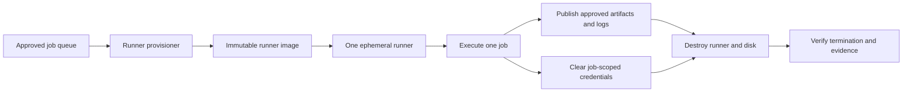

# Shared Runner Security and Hygiene Standard

## Purpose

This standard defines the security baseline for self-hosted and shared CI/CD runners, build agents, executors, and worker pools. Shared runners execute code from many repositories and are a high-value supply-chain target. Their default architecture MUST assume that build code can be malicious or compromised.

## Normative language

The key words **MUST**, **MUST NOT**, **REQUIRED**, **SHOULD**, **SHOULD NOT**, and **MAY** are normative:

- **MUST / MUST NOT**: mandatory for in-scope platforms and workloads.
- **SHOULD / SHOULD NOT**: expected unless a documented risk-based exception is approved.
- **MAY**: optional and selected according to workload requirements.

Where a cloud-provider feature cannot implement a requirement directly, the implementation MUST provide an equivalent control and record the equivalence in the architecture decision record (ADR).

## Runner security principles

1. **Ephemeral by default.** A runner SHOULD process one job and then be destroyed or reimaged.
2. **Strong tenant isolation.** Trust levels, organizations, repositories, environments, and data classifications MUST not share execution capacity without an explicit risk decision.
3. **No durable secrets.** Runners MUST obtain short-lived, job-scoped credentials and MUST not retain them after execution.
4. **Controlled egress.** Build code MUST not have unrestricted access to internal networks or sensitive metadata endpoints.
5. **Known images and reproducible bootstrap.** Runner images, tools, and configuration MUST be versioned and integrity-verified.
6. **Observable and disposable.** Runner creation, job assignment, identity use, network access, and destruction MUST be logged.

## Mandatory requirements

| Requirement | Control statement | Minimum evidence |
|---|---|---|
| `SBP-09-REQ-001` | Shared runners for production delivery SHOULD be ephemeral and MUST be reimaged or destroyed between trust boundaries. | Runner lifecycle logs |
| `SBP-09-REQ-002` | Public or untrusted repositories MUST NOT execute on runners that can reach production networks, credentials, or internal administrative services. | Runner group and network policy |
| `SBP-09-REQ-003` | Runner pools MUST be separated by trust level, environment, organization, and data classification as required by risk. | Pool architecture |
| `SBP-09-REQ-004` | Runners MUST use short-lived job-scoped tokens and workload federation; static cloud credentials are prohibited. | Credential configuration |
| `SBP-09-REQ-005` | Runner registration tokens and control-plane credentials MUST be protected, rotated, and inaccessible to jobs. | Secret store and permissions |
| `SBP-09-REQ-006` | The runner identity MUST have only the permissions required for its assigned job class. | Role policy |
| `SBP-09-REQ-007` | Runner images MUST be built from approved sources, patched regularly, scanned, versioned, and immutable after publication. | Image pipeline and scan report |
| `SBP-09-REQ-008` | Privileged containers, host socket mounts, nested virtualization, and host-level administration MUST be disabled unless explicitly required and isolated. | Executor configuration |
| `SBP-09-REQ-009` | Job egress MUST be restricted to approved source, artifact, package, identity, cloud API, and deployment endpoints where feasible. | Firewall/proxy policy |
| `SBP-09-REQ-010` | Cloud instance metadata endpoints MUST be protected from untrusted job access unless the runner requires a tightly scoped managed identity. | Metadata service configuration |
| `SBP-09-REQ-011` | Workspaces, caches, temporary files, environment variables, and credentials MUST be securely cleared between jobs. | Cleanup verification |
| `SBP-09-REQ-012` | Caches MUST be partitioned by trust boundary and MUST NOT allow untrusted jobs to poison protected build outputs. | Cache key and access design |
| `SBP-09-REQ-013` | Runner logs MUST capture image version, job identity, repository, actor, network class, credential method, and lifecycle events. | Central log query |
| `SBP-09-REQ-014` | Runner software and plugins MUST be pinned, monitored for vulnerability, and upgraded through a controlled process. | Version inventory and patch report |
| `SBP-09-REQ-015` | Emergency interactive access MUST be disabled by default, time-bounded when enabled, and fully audited. | Access log and approval |

## Ephemeral runner lifecycle

## Detailed implementation standard

### Trust-zone design

Runner groups MUST map to explicit trust zones. At minimum, organizations SHOULD separate:

- untrusted pull-request validation;
- trusted internal CI;
- non-production deployment;
- production deployment;
- regulated or sensitive workloads; and
- administrative platform maintenance.

A repository label alone is not sufficient isolation if users can modify labels or target runner groups. Runner assignment controls MUST be centrally governed.

### Ephemeral execution

The preferred lifecycle is provision, register, execute one job, unregister, destroy, and verify destruction. Autoscaling pools MAY keep a warm image or stopped instance, but a used workspace MUST not be reassigned across trust boundaries without a verified reimage.

Persistent runners MUST have a documented justification and compensating controls including strong sandboxing, cleanup verification, local privilege restrictions, and frequent reimaging.

### Container and host isolation

Container isolation alone is insufficient when jobs can run privileged, mount the container runtime socket, access host paths, load kernel modules, or reach the host metadata service. Such capabilities effectively grant host control and MUST be limited to dedicated pools with no cross-tenant reuse.

### Network controls

Runner subnets SHOULD have no inbound administrative access from user networks. Administration SHOULD use a controlled management plane. Egress allowlists MUST account for package ecosystems and update processes; where broad internet access is unavoidable, DNS and proxy logs MUST support investigation.

### Cache and artifact integrity

Caches are untrusted inputs unless cryptographically or logically bound to the trusted source context. Protected release jobs MUST NOT consume caches written by untrusted pull requests. Artifacts crossing trust boundaries MUST be scanned and digest-verified.

### Forensics and containment

The platform MUST support rapid disabling of a runner pool, revocation of registration tokens, invalidation of workload trust, preservation of relevant logs, and rebuild from known-good images. Forensic snapshots MAY be retained under incident-response authority but MUST be isolated from normal scheduling.

## Multi-cloud implementation mapping

| Capability | Azure | AWS | GCP | OCI |
|---|---|---|---|---|
| Ephemeral compute | VM Scale Sets, Container Apps Jobs, AKS nodes | EC2 Auto Scaling, ECS/Fargate, EKS | Managed Instance Groups, Cloud Run Jobs, GKE | Instance Pools, Container Instances, OKE |
| Runner identity | Managed Identity / Entra federation | Instance role / OIDC role | Service account / Workload Identity | Instance or workload principal |
| Image registry | Azure Compute Gallery / ACR | AMI / ECR | Machine Images / Artifact Registry | Custom Images / Container Registry |
| Network control | NSG, Azure Firewall, Private Link | Security Groups, Network Firewall, VPC endpoints | Firewall policies, Secure Web Proxy, PSC | NSGs, Network Firewall, service gateway/private endpoints |
| Monitoring | Azure Monitor / Defender for Cloud | CloudWatch / GuardDuty / Inspector | Cloud Logging / SCC | Logging / Cloud Guard / Vulnerability Scanning |

Provider products are implementation examples, not exemptions from the normative requirements. Equivalent services MAY be used when they satisfy the same control objective.

## Validation

| Measure | Target or interpretation |
|---|---|
| Ephemeral coverage | Percentage of protected jobs executed on one-job runners. |
| Runner image age | Time since last patch/rebuild for active images. |
| Cross-boundary reuse | Instances reused across prohibited trust zones; target zero. |
| Static credential presence | Long-lived cloud credentials on runners; target zero. |
| Termination verification | Jobs whose runner and attached disks were not destroyed within the expected window. |

## Adoption checklist

- [ ] Define runner trust zones and assignment controls.
- [ ] Use one-job ephemeral runners for protected workloads.
- [ ] Build and scan immutable runner images.
- [ ] Use short-lived job-scoped cloud identity.
- [ ] Restrict metadata access, privilege, sockets, and host mounts.
- [ ] Constrain egress and eliminate inbound user administration.
- [ ] Partition caches and verify artifacts across trust boundaries.
- [ ] Centralize runner lifecycle and security logs.
- [ ] Test rapid pool isolation and credential revocation.

## Assurance evidence

Evidence MUST be reproducible and retained according to the enterprise records schedule. Acceptable evidence includes:

- version-controlled configuration and policy;
- pipeline logs and approval records;
- policy evaluation results;
- configuration snapshots or inventory exports;
- test and recovery reports;
- dashboards with query definitions; and
- approved ADRs and exception records.

Screenshots alone SHOULD NOT be treated as primary evidence when machine-readable evidence is available.

## Governance, exceptions, and enforcement

The Cloud Center of Excellence owns this standard. Platform engineering, security, reliability, application, data, and FinOps teams are accountable for implementing controls within their scope.

Exceptions MUST:

1. identify the unmet requirement ID;
2. describe business justification and quantified risk;
3. define compensating controls;
4. name an accountable owner;
5. include an expiry date not exceeding 180 days; and
6. be approved by the control owner and the relevant risk authority.

Expired exceptions are non-compliant. Automated policy checks SHOULD block new non-compliant deployments. Existing non-compliance MUST be tracked through a remediation backlog with owners and due dates.

## Review cycle

This document MUST be reviewed at least annually and after a material change to cloud-provider capabilities, regulatory obligations, enterprise risk tolerance, or the operating model. Changes MUST preserve requirement identifiers where the underlying control intent remains unchanged.

## Related topics

- [CI/CD Pipeline and Release-Control Standard](ci-cd-pipeline-and-release-control-standard.md)
- [Cloud Security and Zero-Trust Standard](cloud-security-and-zero-trust-standard.md)
- [Backup, Recovery, and Resilience Standard](backup-recovery-and-resilience-standard.md)

## References

- [GitHub Actions: Security hardening for self-hosted runners](https://docs.github.com/actions/security-guides/security-hardening-for-github-actions#hardening-for-self-hosted-runners)
- [GitLab Runner security](https://docs.gitlab.com/runner/security/)
- [NIST Secure Software Development Framework, SP 800-218](https://csrc.nist.gov/pubs/sp/800/218/final)
- [SLSA Supply-chain Levels for Software Artifacts](https://slsa.dev/)
- [Microsoft Azure Well-Architected Framework](https://learn.microsoft.com/azure/well-architected/)
- [AWS Well-Architected Framework](https://docs.aws.amazon.com/wellarchitected/latest/framework/welcome.html)
- [GCP Well-Architected Framework](https://cloud.google.com/architecture/framework)
- [OCI Cloud Adoption Framework](https://docs.oracle.com/en-us/iaas/Content/cloud-adoption-framework/home.htm)
