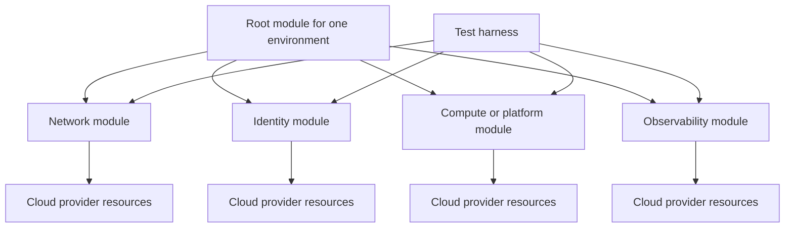

# Terraform 模块设计标准

## 目的

该标准定义了如何设计、发布、版本控制、测试和使用可复用的 Terraform 模块。它应用于批准供企业使用的内部模块和外部采购模块。目标是创建稳定、可组合的构建块，而不是隐藏提供程序行为或组合不相关生命周期的大型抽象。

## 规范语言

关键字 **MUST**、**MUST NOT**、**REQUIRED**、**SHOULD**、**SHOULD NOT** 和 **MAY** 是规范性的：

- **MUST / MUST NOT**：对于范围内的平台和工作负载是强制性的。
- **SHOULD / SHOULD NOT**：预期，除非基于风险的例外情况得到批准。
- **MAY**：可选，根据工作负载需求选择。

在云提供程序功能无法直接实现需求的情况下，实现 MUST 提供等效控制并在架构决策记录（ADR）中记录等效性。

## 模块设计原则

1. **一个一致的责任。** 模块 SHOULD 代表一种资源或具有一个生命周期的紧密耦合的功能。
2. **组合优于编排。** 根模块组合可复用模块；子模块 SHOULD NOT 成为完整的 Landing Zone 或应用平台。
3. **稳定的接口。** 输入和输出是公共 API，MUST 被视为兼容性边界。
4. **安全默认设置。** 默认值 MUST 禁用公共访问、弱加密、匿名身份验证和过宽权限。
5. **提供程序透明度。** 模块 SHOULD 公开有意义的提供程序功能，而无需复制整个提供程序模式。
6. **测试示例。** 支持的使用模式 MUST 可执行并经过验证。

## 强制性要求

|要求 |控制语句|最低限度的证据|
|---|---|---|
| `SBP-02-REQ-001` |每个模块 MUST 有记录在案的、一致的职责，而 MUST NOT 组合不相关的资源只是为减少仓库数量。 |模块用途和架构原则 |
| `SBP-02-REQ-002` |可复用子模块 MUST 遵循标准模块结构，包括 `main.tf`、`variables.tf`、`outputs.tf`、`versions.tf` 和 `README.md` 或明确的等效项。 |仓库树 |
| `SBP-02-REQ-003` |变量 MUST 包括类型约束和描述；验证规则 MUST 用于可执行的域约束。 |变量定义和测试|
| `SBP-02-REQ-004` |敏感输入和输出 MUST 在支持的情况下标记为敏感，并在示例或测试日志中打印 MUST NOT。 |定义和流水线日志审查|
| `SBP-02-REQ-005` |模块 MUST 声明所需的提供程序和 Terraform 版本。子模块 MUST NOT 配置提供程序凭据。 |版本和提供程序声明 |
| `SBP-02-REQ-006` |子模块 SHOULD NOT 包含提供程序块；提供程序配置 MUST 通常由根模块提供。 |静态分析结果|
| `SBP-02-REQ-007` |输出 MUST 代表稳定的集成契约，MUST NOT 公开整个资源对象，除非记录了特定的兼容性原因。 |输出回顾 |
| `SBP-02-REQ-008` |当提供程序功能支持时，安全、私有、加密和受监控的行为 MUST 成为默认行为。 |默认值测试和安全扫描|
| `SBP-02-REQ-009` |可选功能 MUST 是明确的，MUST NOT 创建令人惊讶的资源或特权。 |输入文档和计划测试|
| `SBP-02-REQ-010` |模块 MUST 包括至少一个最小示例和一个代表性生产示例。 |可执行示例 |
| `SBP-02-REQ-011` |模块 MUST 具有自动格式化、验证、linting、安全性、文档和行为测试。 | CI 结果 |
| `SBP-02-REQ-012` |已发布的模块 MUST 使用语义版本控制和不可变的发布标签。 |发布标签和变更日志 |
| `SBP-02-REQ-013` |重大接口更改 MUST 增加主要版本并包括迁移指南。 |变更日志和迁移指南 |
| `SBP-02-REQ-014` |已弃用的输入和输出 SHOULD 在删除之前在记录在案的过渡期内仍然可用。 |弃用通知和时间表 |
| `SBP-02-REQ-015` |外部模块 MUST 源代码固定为不可变版本，并进行许可、维护、安全性和来源审查。 |第三方评估及锁定/来源参考|

## 参考构图模型

## 详细执行标准

### 模块边界

模块边界 MUST 与生命周期边界对齐。总是一起创建、更改和销毁的资源是一个模块的候选资源。由不同团队操作、需要不同权限或以不同节奏更改的资源 SHOULD 被分开。

模块 MUST NOT 在一次调用中创建组织范围的策略、共享网络、生产数据存储和工作负载计算。这种设计创造了过多的特权和状态爆炸半径。

### 界面设计

输入名称 MUST 清晰，并与有用且稳定的提供程序保持一致。布尔功能开关 SHOULD 使用正名称，例如 `enable_private_endpoint`。当复杂对象的结构代表一个内聚概念时，MAY 使用对象；SHOULD 避免深层嵌套对象。

默认值 MUST 是安全的。默认值 MUST NOT 将服务发布到互联网、授予管理员权限、禁用加密或省略所需的日志记录。当不存在普遍安全的默认值时，实现 MUST 提供输入。

输出 SHOULD 返回标识符、端点、身份 ID 以及组合模块所需的其他值。整个资源对象不稳定，因为提供程序架构更改可能会导致意外的接口更改。

### 提供程序和依赖项处理

模块 MUST 声明具有兼容版本约束的 `required_providers`。根模块控制实际的提供程序配置和身份验证。多区域或多账户模式 MAY 使用提供程序别名，并 MUST 通过示例记录。

可复用的模块 SHOULD 最大限度地减少对其他模块的依赖。依赖项 MUST 是版本固定且合理的。禁止循环模块依赖。

### 文档契约

自述文件内容 MUST 包括目的、支持的场景、非目标、要求、提供程序、输入、输出、示例、安全行为、升级说明和支持所有权。使用自动生成的输入/输出表 MAY，但生成的文本不会取代架构解释。

### 测试策略

测试 MUST 涵盖默认值、所需输入、无效输入、可选分支、输出和升级敏感行为。安全测试 SHOULD 断言公共访问已禁用，加密已启用，特权角色受到限制，并且在应用时附加诊断控制。

从失败的默认分支发布 MUST NOT 版本。发布自动化 SHOULD 生成来源元数据以及打包制品的校验和或摘要。

## 多云实施映射

|能力|Azure|AWS | GCP |OCI |
|---|---|---|---|---|
|首选注册表 | Azure Verified Modules 模式或私有注册表 | AWS-IA 模式或私有注册表 | GCP Foundation Fabric 模式或私有注册表 | OCI Terraform 模块或私有注册表 |
|提供程序命名空间示例 | `hashicorp/azurerm`、`azure/azapi` | `hashicorp/aws` | `hashicorp/google` | `oracle/oci` |
|身份默认 |托管身份和最低权限 RBAC | IAM 角色和最小权限策略 |服务账户或工作负载身份 |具有资源/实例/工作负载主体的动态组 |
|私有访问默认 |私有端点/VNet 集成 | PrivateLink / VPC 端点 | Private Service Connect / 私有服务访问 |私有端点/服务网关/私有子网模式|
|原生验证伴侣 | Azure Policy / PSRule | AWS Config / CloudFormation Guard | Organization Policy / Policy Controller|Cloud Guard / Security Zones|

提供程序产品是实施示例，而不是规范要求的豁免。当满足相同的控制目标时，MAY 使用等效服务。

## 验证

|测量 |目标或解释 |
|---|---|
|模块采用|使用批准的模块的合格部署的百分比。 |
|重大变更频率 |主要版本和紧急消费者迁移；越低越好。 |
|测试通过率|发布前所需的检查成功；目标100%。 |
|文档完整性 |提供输入、输出、示例、所有权和升级说明。 |
|安全-默认缺陷|不安全默认造成的调查结果；目标为零。 |

## 采用清单

- [ ] 定义一个连贯的模块职责。
- [ ] 使用标准文件结构。
- [ ] 键入并记录每个变量。
- [ ] 设置安全默认值和明确的选择加入。
- [ ] 避免在子模块中配置提供程序。
- [ ] 展现狭窄、稳定的输出。
- [ ] 添加可执行的最小和生产示例。
- [ ] 测试默认、可选、无效和安全行为。
- [ ] 发布，具有不可变的语义版本和迁移说明。

## 保障性证据

证据 MUST 可根据企业日志保留计划进行复制和保留。可接受的证据包括：

- 版本控制的配置和策略；
- 流水线日志和批准记录；
- 策略评估结果；
- 配置快照或清单导出；
- 测试和恢复报告；
- 带有查询定义的仪表板；和
- 批准的 ADR 和例外日志记录。

当机器可读证据可用时，仅 SHOULD NOT 屏幕截图可被视为主要证据。

## 治理、例外和执行

云卓越中心负责该标准。平台工程、安全性、可靠性、应用、数据和 FinOps 团队负责在其范围内实施控制。

例外情况 MUST 满足以下条件：

1. 识别未满足的需求 ID；
2. 描述业务合理性和量化风险；
3. 定义补偿性控制；
4. 指定一名负责任的所有者；
5. 包含不超过180天的有效期；和
6. 经控制所有者和相关风险主管部门批准。

过期的例外是不合规的。自动策略检查 SHOULD 阻止新的不合规部署。现有不合规项 MUST 通过修复积压、负责人和截止日期进行跟踪。

## 审核周期
本文件 MUST 至少每年审查一次，并且在云提供程序能力、监管义务、企业风险承受能力或运营模式发生重大变化之后进行审查。更改 MUST 保留需求标识符，而底层控制意图保持不变。

## 相关主题

- [基础设施作为代码工程标准](infrastructure-as-code-engineering-standard.md)
- [备份、恢复和弹性标准](backup-recovery-and-resilience-standard.md)
- [CI/CD 流水线与发布控制标准](ci-cd-pipeline-and-release-control-standard.md)

## 参考文档

- [Terraform 标准模块结构](https://developer.hashicorp.com/terraform/language/modules/develop/structure)
- [Terraform 模块创建推荐模式](https://developer.hashicorp.com/terraform/tutorials/modules/pattern-module-creation)
- [Terraform 模块概述](https://developer.hashicorp.com/terraform/language/modules)
- [Terraform 配置语言风格指南](https://developer.hashicorp.com/terraform/language/style)
- [Microsoft Azure Well-Architected Framework](https://learn.microsoft.com/azure/well-architected/)
- [AWS Well-Architected Framework](https://docs.aws.amazon.com/wellarchitected/latest/framework/welcome.html)
- [GCP Well-Architected Framework](https://cloud.google.com/architecture/framework)
- [OCI Cloud Adoption Framework](https://docs.oracle.com/en-us/iaas/Content/cloud-adoption-framework/home.htm)
