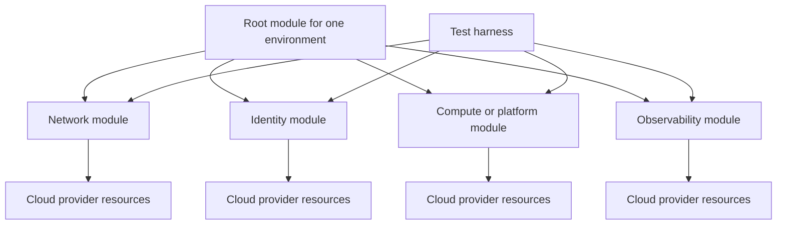

# Terraform Module Design Standard

## Purpose

This standard defines how reusable Terraform modules are designed, published, versioned, tested, and consumed. It applies to internal modules and externally sourced modules approved for enterprise use. The objective is to create stable, composable building blocks rather than large abstractions that conceal provider behavior or combine unrelated lifecycles.

## Normative language

The key words **MUST**, **MUST NOT**, **REQUIRED**, **SHOULD**, **SHOULD NOT**, and **MAY** are normative:

- **MUST / MUST NOT**: mandatory for in-scope platforms and workloads.
- **SHOULD / SHOULD NOT**: expected unless a documented risk-based exception is approved.
- **MAY**: optional and selected according to workload requirements.

Where a cloud-provider feature cannot implement a requirement directly, the implementation MUST provide an equivalent control and record the equivalence in the architecture decision record (ADR).

## Module design principles

1. **One coherent responsibility.** A module SHOULD represent a resource or a tightly coupled capability with one lifecycle.
2. **Composition over orchestration.** Root modules compose reusable modules; child modules SHOULD NOT become full landing zones or application platforms.
3. **Stable interfaces.** Inputs and outputs are a public API and MUST be treated as compatibility boundaries.
4. **Secure defaults.** Public access, weak encryption, anonymous authentication, and broad privileges MUST be disabled by default.
5. **Provider transparency.** A module SHOULD expose meaningful provider capabilities without reproducing the entire provider schema.
6. **Tested examples.** Supported usage patterns MUST be executable and verified.

## Mandatory requirements

| Requirement | Control statement | Minimum evidence |
|---|---|---|
| `SBP-02-REQ-001` | Each module MUST have a documented, coherent responsibility and MUST NOT combine unrelated resources solely to reduce repository count. | Module purpose and architecture rationale |
| `SBP-02-REQ-002` | A reusable child module MUST follow the standard module structure with `main.tf`, `variables.tf`, `outputs.tf`, `versions.tf`, and `README.md` or clear equivalents. | Repository tree |
| `SBP-02-REQ-003` | Variables MUST include type constraints and descriptions; validation rules MUST be used for enforceable domain constraints. | Variable definitions and tests |
| `SBP-02-REQ-004` | Sensitive inputs and outputs MUST be marked sensitive where supported and MUST NOT be printed in examples or test logs. | Definitions and pipeline log review |
| `SBP-02-REQ-005` | Required provider and Terraform versions MUST be declared. Child modules MUST NOT configure provider credentials. | Version and provider declarations |
| `SBP-02-REQ-006` | Child modules SHOULD NOT contain provider blocks; provider configurations MUST normally be supplied by the root module. | Static analysis result |
| `SBP-02-REQ-007` | Outputs MUST represent stable integration contracts and MUST NOT expose whole resource objects unless a specific compatibility reason is documented. | Output review |
| `SBP-02-REQ-008` | Secure, private, encrypted, and monitored behavior MUST be the default when provider capabilities support it. | Default-value tests and security scan |
| `SBP-02-REQ-009` | Optional features MUST be explicit and MUST NOT create surprising resources or privileges. | Input documentation and plan tests |
| `SBP-02-REQ-010` | Modules MUST include at least one minimal example and one representative production example. | Executable examples |
| `SBP-02-REQ-011` | Modules MUST have automated formatting, validation, linting, security, documentation, and behavioral tests. | CI results |
| `SBP-02-REQ-012` | Released modules MUST use semantic versioning and immutable release tags. | Release tags and changelog |
| `SBP-02-REQ-013` | Breaking interface changes MUST increment the major version and include migration guidance. | Changelog and migration guide |
| `SBP-02-REQ-014` | Deprecated inputs and outputs SHOULD remain available for a documented transition period before removal. | Deprecation notice and timeline |
| `SBP-02-REQ-015` | External modules MUST be source-pinned to an immutable version and reviewed for licensing, maintenance, security, and provenance. | Third-party assessment and lock/source reference |

## Reference composition model

## Detailed implementation standard

### Module boundaries

A module boundary MUST align with a lifecycle boundary. Resources that are always created, changed, and destroyed together are candidates for one module. Resources operated by different teams, requiring different privileges, or changed at different cadences SHOULD be separated.

A module MUST NOT create organization-wide policy, shared networking, production data stores, and workload compute in one invocation. Such designs create excessive privilege and state blast radius.

### Interface design

Input names MUST be clear, provider-consistent where useful, and stable. Boolean feature flags SHOULD use positive names such as `enable_private_endpoint`. Complex objects MAY be used when their structure represents one cohesive concept; deeply nested objects that merely duplicate a provider resource SHOULD be avoided.

Defaults MUST be safe. A default MUST NOT publish a service to the internet, grant administrator privileges, disable encryption, or omit required logging. When no universally safe default exists, the input MUST be required.

Outputs SHOULD return identifiers, endpoints, identity IDs, and other values needed by composing modules. Entire resource objects are unstable because provider schema changes can become accidental interface changes.

### Provider and dependency handling

Modules MUST declare `required_providers` with compatible version constraints. The root module controls actual provider configuration and authentication. Provider aliases MAY be required for multi-region or multi-account patterns and MUST be documented with examples.

A reusable module SHOULD minimize dependencies on other modules. Dependencies MUST be version-pinned and justified. Circular module dependencies are prohibited.

### Documentation contract

README content MUST include purpose, supported scenarios, non-goals, requirements, providers, inputs, outputs, examples, security behavior, upgrade notes, and support ownership. Automatically generated input/output tables MAY be used, but generated text does not replace architectural explanation.

### Test strategy

Tests MUST cover defaults, required inputs, invalid inputs, optional branches, outputs, and upgrade-sensitive behavior. Security tests SHOULD assert that public access is disabled, encryption is enabled, privileged roles are constrained, and diagnostic controls are attached when applicable.

A release MUST NOT be published from a failing default branch. Release automation SHOULD produce provenance metadata and a checksum or digest for packaged artifacts.

## Multi-cloud implementation mapping

| Capability | Azure | AWS | GCP | OCI |
|---|---|---|---|---|
| Preferred registry | Azure Verified Modules pattern or private registry | AWS-IA patterns or private registry | GCP Foundation Fabric patterns or private registry | OCI Terraform modules or private registry |
| Provider namespace example | `hashicorp/azurerm`, `azure/azapi` | `hashicorp/aws` | `hashicorp/google` | `oracle/oci` |
| Identity default | Managed identity and least-privilege RBAC | IAM role and least-privilege policy | Service account or workload identity | Dynamic group with resource/instance/workload principal |
| Private access default | Private Endpoint / VNet integration | PrivateLink / VPC endpoints | Private Service Connect / private services access | Private endpoints / service gateway / private subnet patterns |
| Native validation companion | Azure Policy / PSRule | AWS Config / CloudFormation Guard | Organization Policy / Policy Controller | Cloud Guard / Security Zones |

Provider products are implementation examples, not exemptions from the normative requirements. Equivalent services MAY be used when they satisfy the same control objective.

## Validation

| Measure | Target or interpretation |
|---|---|
| Module adoption | Percentage of eligible deployments using approved modules. |
| Breaking-change frequency | Major releases and emergency consumer migrations; lower is better. |
| Test pass rate | Required checks successful before release; target 100%. |
| Documentation completeness | Inputs, outputs, examples, ownership, and upgrade notes present. |
| Security-default defects | Findings caused by insecure defaults; target zero. |

## Adoption checklist

- [ ] Define one coherent module responsibility.
- [ ] Use the standard file structure.
- [ ] Type and document every variable.
- [ ] Set secure defaults and explicit opt-ins.
- [ ] Avoid provider configuration in child modules.
- [ ] Expose narrow, stable outputs.
- [ ] Add executable minimal and production examples.
- [ ] Test default, optional, invalid, and security behavior.
- [ ] Release with immutable semantic versions and migration notes.

## Assurance evidence

Evidence MUST be reproducible and retained according to the enterprise records schedule. Acceptable evidence includes:

- version-controlled configuration and policy;
- pipeline logs and approval records;
- policy evaluation results;
- configuration snapshots or inventory exports;
- test and recovery reports;
- dashboards with query definitions; and
- approved ADRs and exception records.

Screenshots alone SHOULD NOT be treated as primary evidence when machine-readable evidence is available.

## Governance, exceptions, and enforcement

The Cloud Center of Excellence owns this standard. Platform engineering, security, reliability, application, data, and FinOps teams are accountable for implementing controls within their scope.

Exceptions MUST:

1. identify the unmet requirement ID;
2. describe business justification and quantified risk;
3. define compensating controls;
4. name an accountable owner;
5. include an expiry date not exceeding 180 days; and
6. be approved by the control owner and the relevant risk authority.

Expired exceptions are non-compliant. Automated policy checks SHOULD block new non-compliant deployments. Existing non-compliance MUST be tracked through a remediation backlog with owners and due dates.

## Review cycle

This document MUST be reviewed at least annually and after a material change to cloud-provider capabilities, regulatory obligations, enterprise risk tolerance, or the operating model. Changes MUST preserve requirement identifiers where the underlying control intent remains unchanged.

## Related topics

- [Infrastructure as Code Engineering Standard](infrastructure-as-code-engineering-standard.md)
- [Backup, Recovery, and Resilience Standard](backup-recovery-and-resilience-standard.md)
- [CI/CD Pipeline and Release-Control Standard](ci-cd-pipeline-and-release-control-standard.md)

## References

- [Terraform standard module structure](https://developer.hashicorp.com/terraform/language/modules/develop/structure)
- [Terraform module creation recommended pattern](https://developer.hashicorp.com/terraform/tutorials/modules/pattern-module-creation)
- [Terraform modules overview](https://developer.hashicorp.com/terraform/language/modules)
- [Terraform configuration language style guide](https://developer.hashicorp.com/terraform/language/style)
- [Microsoft Azure Well-Architected Framework](https://learn.microsoft.com/azure/well-architected/)
- [AWS Well-Architected Framework](https://docs.aws.amazon.com/wellarchitected/latest/framework/welcome.html)
- [GCP Well-Architected Framework](https://cloud.google.com/architecture/framework)
- [OCI Cloud Adoption Framework](https://docs.oracle.com/en-us/iaas/Content/cloud-adoption-framework/home.htm)
