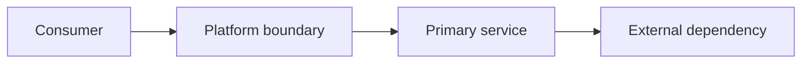

# Replace with a clear architecture title

State the decision, the problem it solves, the intended audience, and the expected outcome.

## Purpose

Explain the business and engineering problem, decision scope, and success criteria.

## Context and decision drivers

Document constraints, assumptions, workload characteristics, dependencies, and quality attributes.

## Options considered

Compare credible alternatives, tradeoffs, rejected options, and the reason for the selected direction.

## Reference architecture

Describe trust boundaries, major components, ownership, data/control flows, and integration points.

<!-- Diagram required: include a Mermaid context/container or component diagram. Show boundaries, identities,
     network paths, data flows, and external dependencies. Add a short caption and explain the diagram in prose. -->

## Security, resilience, and cost

Cover identity, trust boundaries, data protection, failure domains, recovery, scaling, and cost drivers.

## Operational considerations

Document ownership, monitoring, alerting, change control, support boundaries, failure handling, and recovery.

## Validation

- [ ] Architecture review confirms the decision drivers and constraints.
- [ ] Security, resilience, cost, and operational assumptions have evidence.
- [ ] The reference architecture and all critical flows are internally consistent.

## Related topics

Link to related canonical Markdown articles using relative Markdown links and keep their document IDs in sync.

<!-- Definition of done: complete metadata, diagram, alternatives, operational impact, validation evidence,
     related links, link checks, and the repository validation suite. -->
