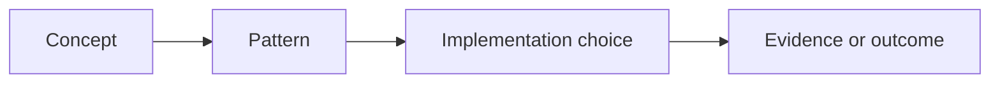

# Replace with a clear guide or reference title

Explain the reusable idea, vocabulary, decision context, and intended reader.

## Purpose or scope

Define the subject boundary, terminology, assumptions, and intended use.

## Reference content

Present the model, patterns, taxonomy, comparison, decision guidance, or lookup material. Prefer tables for stable mappings.

<!-- Diagram recommended when the guide explains relationships, hierarchy, lifecycle, or a decision path.
     Use Mermaid for a conceptual map, flowchart, sequence, or state diagram and explain it in prose. -->

## Practical considerations

Document tradeoffs, boundaries, security, operations, cost, version assumptions, and common misinterpretations where applicable.

## Validation

- [ ] Definitions and mappings are internally consistent.
- [ ] Examples and references are current and reproducible.
- [ ] The reader can apply the guidance or use the reference without hidden assumptions.

## Related topics

Link to related canonical Markdown articles using relative Markdown links and keep their document IDs in sync.

<!-- Definition of done: scope is bounded, reference content is unambiguous, diagrams are explained when used,
     examples and links are verified, lifecycle metadata is complete, and the repository validation suite passes. -->
