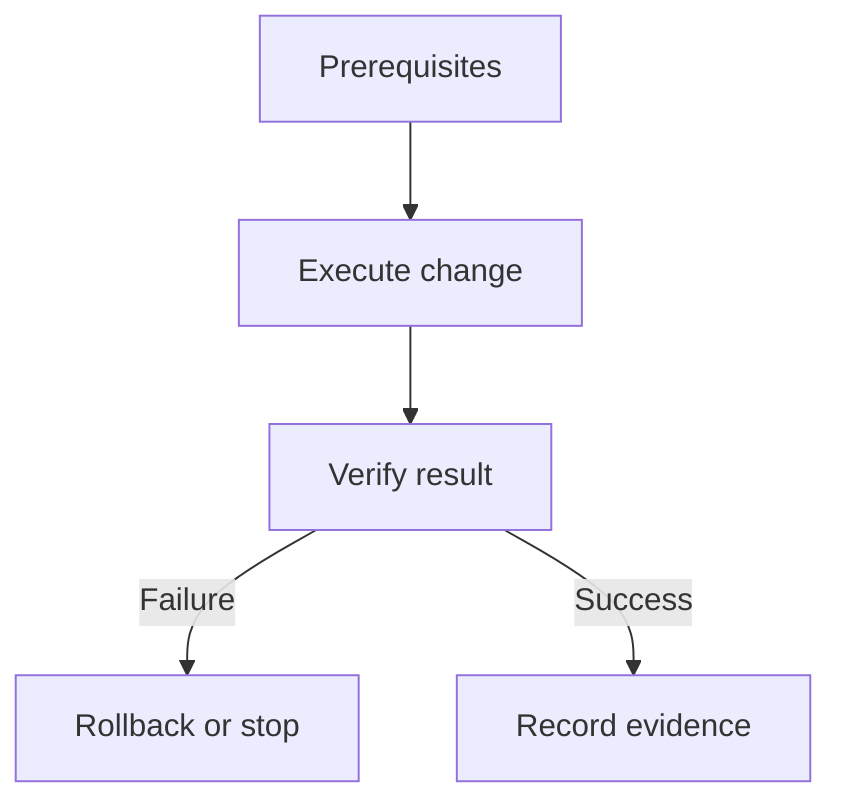

# How to replace with a clear task title

State the desired outcome, the safe operating boundary, and what the reader will have at the end.

## Objective

Define the task, expected result, scope, and what this procedure does not cover.

## Prerequisites

List required access, tools, versions, inputs, backups, approvals, and a safe test environment.

## Procedure

Use ordered steps only where sequence matters. Include commands, expected output, checkpoints, and rollback points.

<!-- Diagram recommended for multi-stage procedures; required when the procedure changes production state.
     Use a Mermaid flowchart or sequence diagram showing actors, gates, retries, and rollback paths. -->

## Validation

- [ ] The procedure completes successfully in the supported environment.
- [ ] Expected output, health checks, and evidence are documented.
- [ ] Permissions, idempotency, and failure behavior are verified.

## Troubleshooting or rollback

Document common failure modes, diagnostic commands, stop conditions, rollback, and escalation.

## Related topics

Link to related canonical Markdown articles using relative Markdown links and keep their document IDs in sync.

<!-- Definition of done: prerequisites are reproducible, steps are safe and ordered, verification and rollback
     are explicit, commands are tested, links are checked, and the repository validation suite passes. -->
