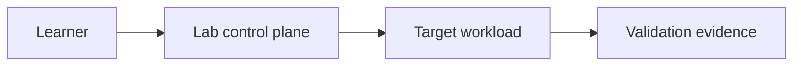

# Replace with a clear hands-on lab title

State the learning outcome, supported environment, estimated duration, and cleanup expectation.

## Lab overview

Describe the scenario, learning objectives, success criteria, scope, and what the lab intentionally omits.

## Prerequisites

List subscriptions, accounts, quotas, tools, versions, permissions, source repositories, and estimated cost.

## Target architecture

Describe the resources, trust boundaries, identities, network paths, data flows, and lab-specific topology.

<!-- Diagram required: include a Mermaid architecture and execution-flow diagram. Show target resources,
     learner/operator actions, external services, identities, and cleanup boundaries. -->

## Lab modules

Break the exercise into repeatable modules. Include commands, expected output, checkpoints, and evidence for each module.

## Validation

- [ ] Each learning objective has a pass/fail check.
- [ ] Deployment, security, functional, and operational evidence is captured.
- [ ] The lab can be repeated from the stated versions and source commits.

## Cleanup

Remove billable resources, temporary identities, test data, credentials, local artifacts, and access grants. Verify cleanup.

## Related topics

Link to related canonical Markdown articles using relative Markdown links and keep their document IDs in sync.

## Related Repos

List only repositories directly used by the lab, with a pinned commit when reproducibility depends on source code.

<!-- Definition of done: metadata is complete, prerequisites and cost are clear, diagrams are present, every
     module has evidence, cleanup is verified, source versions are pinned, links are checked, and validation passes. -->
