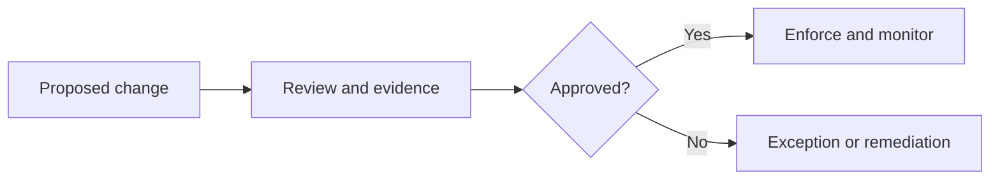

# Replace with a clear standard title

State the control objective, scope, applicability, and accountable owner.

## Purpose

Explain the risk or outcome the standard controls and why it applies.

## Scope and normative language

Define in-scope systems, teams, environments, exceptions, and the meaning of MUST, SHOULD, and MAY.

## Mandatory requirements

List testable requirements with clear owners, evidence expectations, and exception conditions.

## Control model and governance

Describe control ownership, approval, enforcement, review cadence, exception handling, and escalation.

<!-- Diagram required when the standard contains a lifecycle or approval flow: use a Mermaid state, flow,
     or sequence diagram. Show control points, evidence, and exception paths; explain it in prose. -->

## Implementation guidance

Give practical implementation patterns without weakening the normative requirements.

## Validation

- [ ] Each mandatory requirement has a repeatable test or evidence source.
- [ ] Ownership, enforcement, exception, and review paths are explicit.
- [ ] Control results can be retained for audit or operational review.

## Related topics

Link to related canonical Markdown articles using relative Markdown links and keep their document IDs in sync.

<!-- Definition of done: requirements are testable, exceptions are governed, evidence is defined, diagrams
     are explained, links are verified, and the repository validation suite passes. -->
